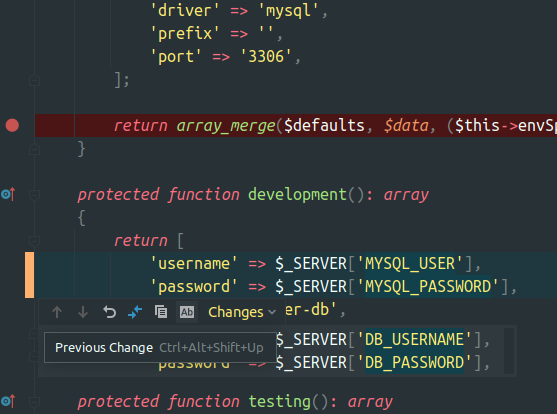

# Addebiti rate da corrieri
	- dovento testare script per ricerca nuovi addebiti non riesco a far eseguire il canary in locale con `docker/production`
- 
	- nel file `ConnAdapter.php` é stato fatto un rename di variabili che non é riflesso nel `docker/production`