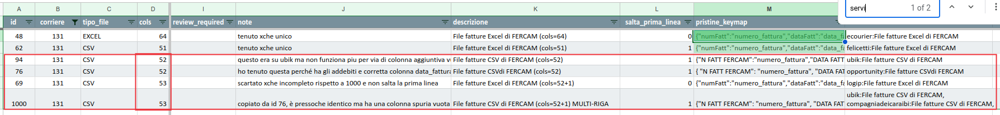

# Mattina
	- ## Mappature errate
	  id:: 6549effa-4020-4d08-8a12-2a1950c4f2a2
		- DONE creare task per aggiornare la pagina https://app.gitbook.com/o/-LhpbdRCZplUyqAg775u/s/-LhfceF_wafd4SAdacDi/mappare-un-nuovo-file descrivendo [FT-102|Aggiornare la pagina su come configurare opener in gitbook (prima di migrazione)](https://gsped.atlassian.net/browse/FT-102)
			- creare anche una checklist di controlli da fare per la copia di una mappatura #doc/internal #[[Progetti/Motore di Fatturazione]] poiché oggi non é presente una #topic/GUI per il data entry con validazione e #business-rule
	- ## Continuo ((65771537-96fc-4d69-aa39-aea3328197896548f6b4-2eea-4fce-9c81-d1397208d36f))
		- DONE creata card jira https://gsped.atlassian.net/browse/FT-100
	- ## ~~Tema bug interfaccia listini~~
		- DONE [#A] censire in board Jira la richiesta di analisi per i bug #jira/admin-request/grant #action/task/new AN-43
		  id:: 654baef3-cc8e-4a46-bc7f-855307070aa2
		  :LOGBOOK:
		  CLOCK: [2023-11-09 Thu 16:38:56]--[2023-11-09 Thu 16:38:57] =>  00:00:01
		  :END:
	- ## Richiesta aiuto ps ups service Ricci
		- non riusciva a montare folder in container docker, `chmod a+w` e restart
	- ## Creazione spazio progetti
		- DONE Ho creato la pagina #[[Progetti/Motore di Fatturazione]]
		- Ho creato la pagina #[[Instrument/C4]]
- # Pomeriggio
	- ## Continuo ((6549effa-4020-4d08-8a12-2a1950c4f2a2))
		- FERCAM
			- 
				- ci sono degli opener senza servizio, come fanno a funzionare?
				- verifico come mai ubik con FERCAM funziona !!
					- l'opener é stato rimpiazzato rispetto al master file !!!
					  background-color:: red
					- é stato copiato da Felicetti, infatti ha pure lui il servizio ⚠️ ! ho aggiornato il master file
					- purtroppo nella copia da Felicetti il campo ADD_VARI finale é stato brasato
					-
	- ## Ragiono su come organizzare LogSeq per lavoro
		- Conviene creare una sezione in #[[Guida d'uso LogSeq]] detta ((654baa92-a7e7-46c5-816e-42bc25765463))
-