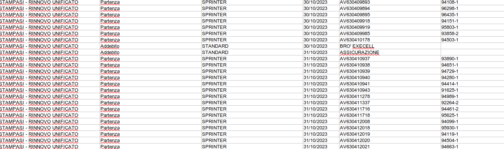
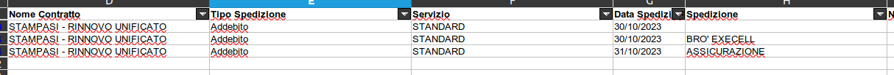

# Mattina
	- Ragiono su come capire le variazioni sulle tabelle degli opener :
		- Soluzione veloce ed economica: mettere delle colonne created_at e updated_ad sulle tabelle file_opener_config in maniera che capiamo
	- Aiuro Urso con Stampasi, il file di correzione generato é corretto anche se non sembra , elaborazione **15831, 15829**
		- 
		- 
	-