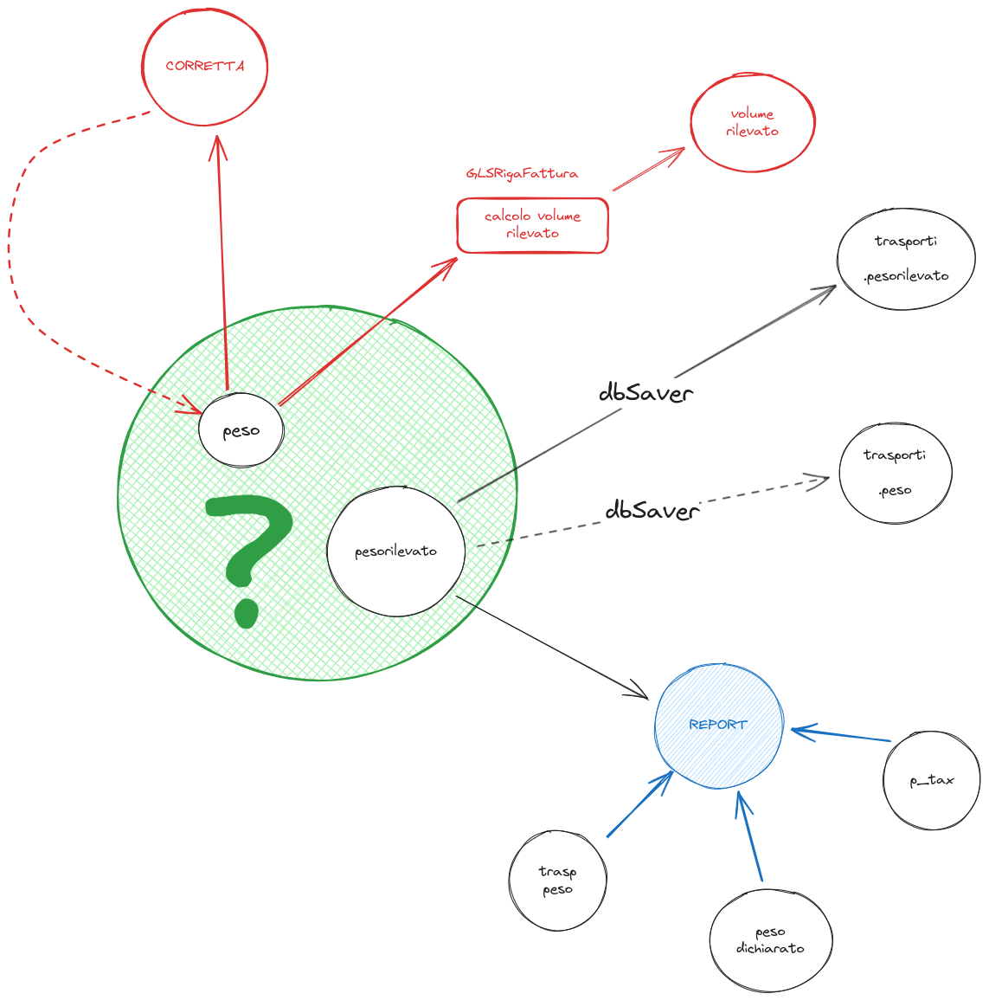

- Rivedi il tuo processo di [[Process/Tasks Management/My GTD]]
- Vai al template del [[Templates/Daily Journal]] per migliorarlo
- # Richieste assistenza
	- ## Stand-up
		- DONE Verificare se Valerio ha concesso il grant per questo per board Analisi
		  :LOGBOOK:
		  CLOCK: [2023-11-09 Thu 10:24:51]--[2023-11-09 Thu 10:24:52] =>  00:00:01
		  CLOCK: [2023-11-09 Thu 10:24:52]--[2023-11-09 Thu 10:24:53] =>  00:00:01
		  CLOCK: [2023-11-09 Thu 10:24:54]--[2023-11-09 Thu 10:24:54] =>  00:00:00
		  CLOCK: [2023-11-09 Thu 10:24:55]--[2023-11-09 Thu 10:24:55] =>  00:00:00
		  :END:
			- ((654baef3-cc8e-4a46-bc7f-855307070aa2))
		- Continuare ... {{embed ((654baef3-4f40-4738-85c7-c4df81712e6f))}}
	- ## Via e-mail
		- Nessuna richiesta
	- ## Via slack
		- Priscilla
			- [#A] #client/Stampasi #courier/GLS che giro fa per calcolare il Max Peso Volume [[topic/Massimo tra Peso e Peso Volumetrico]] #business-rule ?
			  id:: 65523f3a-9814-4413-8773-73e36d6d0162
			  :LOGBOOK:
			  CLOCK: [2023-11-09 Thu 16:51:46]
			  :END:
				- La #jira/issue é [FT-89|StampaSi - Controllo fattura GLS](https://gsped.atlassian.net/browse/FT-89)
				- riprendo questo diagramma riguardo all'uso della variabili `peso` e `pesorilevato` per #courier/GLS
				- esaminare elaborazione 15829, vedi #troubleshooting
				- {:height 528, :width 514}
				- scoprire come viene trattato il campo #topic/p_tax dal #[[Progetti/Motore di Fatturazione/Mappature]] e altri model  #model/shipment/trasporti #business-rule/calcolo-tariffario #[[topic/peso tassato]] #issue/doc/missing
				  :LOGBOOK:
				  CLOCK: [2023-11-13 Mon 09:38:12]
				  :END:
					- questo e altri concetti esistono come #topic ma anche come variabili di #business-rule e #Processi
				- Priscilla ha scritto al corriere per applicazione del giusto calcolo peso o volume
				-
			- LATER fare riferimento a questa conversazione per FERCAM UNIFARCO e verificare come mai non aggancia le tariffe https://gsped.slack.com/archives/D051G6YB5UJ/p1699348026676479 e aggiornare la card JIRA opportuna [FT-100|UNIFARCO: importazione fatture Fercam, TNT e DHL](https://gsped.atlassian.net/browse/FT-100)
			- LATER Completare la card [AN-43|ANALISI - Richieste risoluzione #bug gravi da interfaccia listini, richiedente Priscilla](https://gsped.atlassian.net/browse/AN-43) con Priscilla
			  :LOGBOOK:
			  CLOCK: [2023-11-09 Thu 19:11:22]--[2023-11-10 Fri 20:11:15] =>  24:59:53
			  :END:
		- Bnb
			- DONE Analizzare problema segnalato su errore JOIN via slack https://gsped.slack.com/archives/C0521UF8MFT/p1699524120024039
			  :LOGBOOK:
			  CLOCK: [2023-11-09 Thu 16:51:20]--[2023-11-09 Thu 19:15:14] =>  02:23:54
			  CLOCK: [2023-11-09 Thu 19:15:14]--[2023-11-09 Thu 19:15:16] =>  00:00:02
			  :END:
				- DONE Fixare Assenza della tabella `file_opener_config` #bug
				  :LOGBOOK:
				  CLOCK: [2023-11-09 Thu 16:51:24]--[2023-11-10 Fri 20:02:53] =>  27:11:29
				  :END:
					- DONE  inserire codice SQL da utilizzarsi per eseguire query schedulata #jira/issue/comeout [FT-105|Assenza tabella `file_opener_config` su alcune istanze](https://gsped.atlassian.net/browse/FT-105)
						- LATER Rieseguire la query che non era andata a buon fine ((654baef3-4f40-4738-85c7-c4df81712e6f))
						  :LOGBOOK:
						  CLOCK: [2023-11-10 Fri 20:03:15]--[2023-11-10 Fri 20:11:50] =>  00:08:35
						  CLOCK: [2023-11-10 Fri 20:11:51]--[2023-11-10 Fri 20:11:52] =>  00:00:01
						  :END:
				- DONE Verificare lo stato della #jira/issue sul #bug/fix per ordinamento della colonna corriere in #[[Progetti/Motore di Fatturazione]] [PS22-252|Controllo Fatture : ordinamento per nome corriere restituisce 500](https://gsped.atlassian.net/browse/PS22-252)
				  :LOGBOOK:
				  CLOCK: [2023-11-09 Thu 18:48:04]--[2023-11-09 Thu 18:50:49] =>  00:02:45
				  CLOCK: [2023-11-09 Thu 18:50:50]--[2023-11-09 Thu 18:50:51] =>  00:00:01
				  :END:
					- DONE necessita di fare la #action/PR su #env/production essendo una #hotfix
					  SCHEDULED: <2023-11-14 Tue>
					  :LOGBOOK:
					  CLOCK: [2023-11-09 Thu 19:14:21]--[2023-11-09 Thu 19:14:23] =>  00:00:02
					  CLOCK: [2023-11-10 Fri 20:01:48]--[2023-11-10 Fri 20:11:31] =>  00:09:43
					  :END:
		- DONE Richiesta di Fabio : revisione PR https://eu-west-1.console.aws.amazon.com/codesuite/codecommit/repositories/Gsped7/pull-requests/365
			- ho approvato la PR stranamente avevo i permessi 😅
	- ## Varie
		- Ho creato questa nota ((654c933f-1880-429f-a79a-b7108755b5d9))
		- Ho creato questa nota  ((654d06e4-98c0-44f7-81e9-5a999d3bea1d))
		- Ho creato questa nota  ((654cee34-2226-4ac3-a03f-3462e15cfd5c))
		  id:: 654ca6ed-4776-4edc-b4a6-846b3f42dfd2
		- DONE Creato task Uso di #jira/cloud in #Instrument/slack
		  :LOGBOOK:
		  CLOCK: [2023-11-09 Thu 17:48:59]--[2023-11-09 Thu 17:48:59] =>  00:00:00
		  :END:
		- DONE Creare alcuni tag importanti per la gestione delle informazioni in #LogSeq
		  :LOGBOOK:
		  CLOCK: [2023-11-09 Thu 17:33:34]--[2023-11-09 Thu 17:33:35] =>  00:00:01
		  CLOCK: [2023-11-09 Thu 17:33:43]--[2023-11-09 Thu 17:37:20] =>  00:03:37
		  CLOCK: [2023-11-09 Thu 17:46:28]--[2023-11-09 Thu 17:46:29] =>  00:00:01
		  :END:
			- DONE tag per marcare le issue di #jira che vanno censite: #jira/issue/comeout
			- DONE tag per condivisione di informazioni #[[Process/Knowledge Sharing]]
			  :LOGBOOK:
			  CLOCK: [2023-11-09 Thu 17:37:03]--[2023-11-09 Thu 17:37:03] =>  00:00:00
			  CLOCK: [2023-11-09 Thu 17:37:04]
			  :END:
			- DONE Tags per segnalare problemi o miglioramenti #improvements #issue