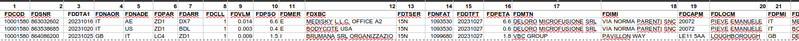
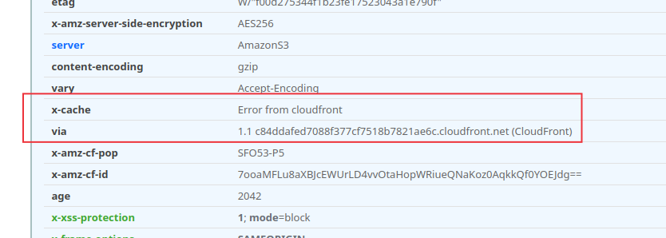

- Vai alla guida del tuo processo di [[Process/GTD/MyDailyPlanning]]
- Vai al template del [[Templates/Daily Journal]] per migliorarlo
- # Richieste del giorno
	- ## Stand-up
		- Non sono state raccolte richieste da inserire qui
	- ## Via e-mail
		- Non sono state raccolte richieste da inserire qui
	- ## Durante il giorno
		- ### 9:15 #meeting Analisi TNT collectionDate alla conferma https://meet.google.com/qck-yvrm-hev
		  collapsed:: true
			- tempistiche 2-3w
			- io posso validare ma non ho abbastanza visione d'insieme #CAUTION
			- ci va uno stato intermedio 💡
			- #### Domande
				- mi sembra di capire per asincrono si parla di elaborazione asincrona e non codice asincrono, ho capito bene ?
					- ~~per asincrono proporre ReactPHP~~
				- che tipo di feed back deve ricevere il cliente ?
				- quali sono tutti gli stati della spedizione ?
				- quali sono le possibili interazioni con i corrieri ?
					- elencare le chiamate
					- elencare batch che leggono a intervalli gli stati remoti
					- esistono webhook ?
				- esiste una #doc/internal sul flusso ?
				  collapsed:: true
					- il flusso che avviene per le spedizioni  non é documentato #WARNING #issue
						- non disponendo del documento si perde un tempo esagerato nell'analizzare
						- i nuovi arrivati sono totalmente spaesati
						- valutare nuove integrazioni é complicato
						- non hai una visione d'insieme
				- quale é il flusso dall'interfaccia ?
				- chi usa l'interfaccia ???
					- pochi clienti ?
					- non sapevo che fossero pochi .. 😭
				- come viene confermata una spedizione ?
					- chiamata HTTP
					- nessuna conferma
					- ???
				- ci sono reseller che fanno B2B con add parcel differito tra api e interfaccia ?
					- riascoltare il video al minuto 2:25 - 2:26
					- https://drive.google.com/file/d/1Hp8vAJUPHSBVOw_46ArPdrlwcsHr55X0/view?usp=drivesdk
				- quanto conoscete #Instrument/php/swool ?
			- #### Actions
			  :LOGBOOK:
			  CLOCK: [2023-11-10 Fri 12:10:51]--[2023-11-10 Fri 14:39:35] =>  02:28:44
			  CLOCK: [2023-11-10 Fri 14:39:46]
			  :END:
				- vedere la Magento Queue `\App\controllers\Magento_queue`
				- condividere le mie note
				- creare una card Jira
					- fare un documento con punti di intervento
					- fare un doc con le note
				- DONE ho fatto una registrazione video su OBS, censire su drive e rinominare
				  :LOGBOOK:
				  CLOCK: [2023-11-10 Fri 11:23:31]
				  CLOCK: [2023-11-10 Fri 16:50:04]--[2023-11-10 Fri 16:50:05] =>  00:00:01
				  CLOCK: [2023-11-10 Fri 16:50:08]--[2023-11-10 Fri 16:50:09] =>  00:00:01
				  CLOCK: [2023-11-10 Fri 16:50:16]--[2023-11-10 Fri 20:12:03] =>  03:21:47
				  :END:
				- DONE verificare che non ci siano mega task che occupato
				  SCHEDULED: <2023-11-13 Mon>
				  :LOGBOOK:
				  CLOCK: [2023-11-10 Fri 14:40:37]
				  CLOCK: [2023-11-10 Fri 14:40:41]--[2023-11-10 Fri 20:12:10] =>  05:31:29
				  CLOCK: [2023-11-13 Mon 09:25:51]--[2023-11-15 Wed 17:08:37] =>  55:42:46
				  :END:
				- capire chi potrebbe spiegarmi un po' concetti chiave
				-
			- #### Altro
				- ho installato obs local stream marker , CTRL + `+` per fare il marker
			-
		- #### Aiuto Priscilla
			- DONE Verificare formato fattura #courier/TNT per #client/Brumana se il formato é supportato #[[Progetti/Motore di Fatturazione]]
			  :LOGBOOK:
			  CLOCK: [2023-11-10 Fri 14:40:52]--[2023-11-10 Fri 18:10:49] =>  03:29:57
			  :END:
				- DONE Creato Ticket jira [FT-10|Recuperare i files di esempio e generalizzarli](https://gsped.atlassian.net/browse/FT-10)
				- ho aggiunto una nota in ((654d0c7c-b44b-4a3c-b69e-fb443eee047e)) indicando campi
				- il formato é supportato da opener censito in master file con ID 64, alleghiamo qui la mappatura e uno scorcio del file :
				  collapsed:: true
					- 
					- ```
					  {
					    "FDCOD": "contratto",
					    "FDSNR": "num_spedizione",
					    "FDDTA1": "data_spedizione",
					    "FDNAOR": "",
					    "FDNADE": "",
					    "FDPAR": "",
					    "FDARR": "",
					    "FDCLL": "colli",
					    "FDVLM": "volumerilevato",
					    "FDPSO": "pesorilevato",
					    "FDMER": "",
					    "FDXBC": "riferimento_alphanumerico",
					    "FDTSER": "servizio",
					    "FDNFAT": "num_fattura",
					    "FDDTFT": "data_fattura",
					    "FDPETA": "p_tax",
					    "FDMTN": "nome_mittente",
					    "FDIMI": "indirizzo_mittente",
					    "FDCAPM": "cap_mittente",
					    "FDLOCM": "citta_mittente",
					    "FDPMI": "nazione_mittente",
					    "FDDST": "nome_destinatario",
					    "FDINDD": "indirizzo_destinatario",
					    "FDCAPD": "cap_destinatario",
					    "FDLOCD": "citta_destinatario",
					    "FDPDE": "nazione_destinatario",
					    "FDDATC": "data_consegna",
					    "FDORAC": "ora_consegna",
					    "FDIMPO_E": "nolo"
					  }
					  ```
		- #### Valerio Security Header #Progetti/Wizard
			- https://gsped-wizard.gsped.it , lettura mail compliance
				- per questo task come per altri niente card in #issue/jira
				- configurazione attuale **CSP**
					- ```
					  default-src 'none'; script-src 'self'; 
					  style-src 'self' 'unsafe-hashes' 'sha256-MS0CQ1p6k/Su1rXNYtEYQpoZR7flCjtQIiMXp7KRnEE=' 
					     'sha256-i3fT4WN/TT+dqcrJS2kgXccf5Nggk2Kw3cb3SQSywRg=' 
					     'sha256-M9HMoAKEj9V5dHwBFE5WbZn21Gg+Uuw7BeTywxTgjRc='; 
					  object-src 'none'; 
					  connect-src 'self' https://api.gsped.it; 
					  img-src 'self' https://www.gsped.it; 
					  font-src 'self' https://fonts.gstatic.com;
					  ```
				- Attuale risposta scansione security headers
					- 
					- oggi persiste un errore cloud front
				- Bisogna attendere
		- #### Repo di Business Rules
			- Purtroppo in GSped non esiste un archivio di #business-rules #WARNING
			- LATER [#A] Molto importante creare un repository di #business-rules #improvements #doc
			-
		-
- # Interruzioni
	- PlantUML puó essere utilizzato velocemente per creare #Process/SDC/documentation
		- Class Diagram in tempo reale
		- Sequence Diagram in tempo reale
		- Creare un #Process/Sharing/Howtos per uso di #PlantUML #diagrams
	- Excalidraw puó essere utilizzato velocemente per creare diagrammi a blocchi o DFD
		- Creare un #Process/Sharing/Howtos per uso #Excalidraw #diagrams