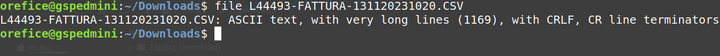
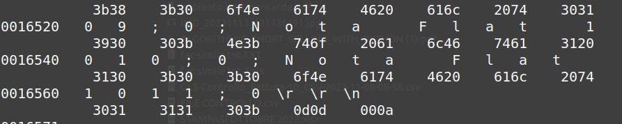

# Richieste del giorno
	- ## Via slack
		- Rilevato #issue/outage #[[Progetti/Gsped API]] #[[Progetti/Gsped Legacy]] #FAILED
			- DONE annotare a fine giornata il motivo 
			  SCHEDULED: <2023-11-13 Mon>
			  :LOGBOOK:
			  CLOCK: [2023-11-13 Mon 11:58:38]--[2023-11-13 Mon 11:58:39] =>  00:00:01
			  :END:
			- il problema era numero di instanze di #warmup
- # Lavorazioni
	- ### **Priscilla**
		- Riprendo task di ieri {{embed ((65523f3a-9814-4413-8773-73e36d6d0162))}}
		- #### NOW #client/Brumana #courier/TNT verificare se opener #topic/internazionale funziona su #topic/nazionale
		  id:: 6553499a-f599-406d-942f-da80849de8be
		  :LOGBOOK:
		  CLOCK: [2023-11-13 Mon 09:49:18]
		  CLOCK: [2023-11-13 Mon 19:55:31]
		  :END:
			- #courier/TNT
				- **DOMANDA**
					- ma che succede se usato su fatture miste int e non int ?
					- DONE verificare anceh queste [[Progetti/Motore di Fatturazione/Mappature]]
					  :LOGBOOK:
					  CLOCK: [2023-11-13 Mon 10:12:28]--[2023-11-13 Mon 10:12:29] =>  00:00:01
					  :END:
						- ~~EXCEL ok lo abbiamo il 90 colonne~~
						- ~~TXT diversa lunghezza va mappato ad-hoc~~
					- si potrebbe clonare la configurazione senza internazionale ma la **fattura rimane sempre mista** ?
						-
				- Rilevata #issue/code in `fatturazione/application/entity/RigaFattura.php` che ha logica specifica per #courier/TNT, andrebbe gestita in una classe figlia #[[Progetti/Motore di Fatturazione]] #Process/SDC/design/OOP
					- documentare in #doc/internal #doc/code che fa l'opener di #courier/TNT #business-rule rispetto a quello non #topic/internazionale
						- DONE non esiste un #topic di concetti fondamentali che riguarda i concetti in Gsped utili anche per chi entra #Process/Onboarding #issue/performance , creare una pagina di #topic #doc/internal
				- ho riferito di guardare la card [FT-108|Brumana | TNT: verifica support formato internazionale del file allegato](https://gsped.atlassian.net/browse/FT-108)  per ció che ho scritto
				  id:: 6553499a-7613-4354-8f44-87f08f923359
			- #courier/GLS verifica formato file
				- 
				- 
				- `cat -e <filename>` comando interessante che mostra i caratteri non stampabili come stringhe nell'output #[[Process/Knowledge Sharing/Howtos]] aggiungere a #troubleshooting
				- DONE richiedere un test di caricamento ugualmente e scrivere risultato e annotare gira
				  :LOGBOOK:
				  CLOCK: [2023-11-15 Wed 10:12:42]--[2023-11-15 Wed 20:12:28] =>  09:59:46
				  CLOCK: [2023-11-15 Wed 20:12:29]--[2023-11-15 Wed 20:12:30] =>  00:00:01
				  :END:
		-
		- [TRASH-149|CONTROLLO FATTURE - CENTROLIBRI](https://gsped.atlassian.net/browse/TRASH-149) #client/centrolibri
			- Da dove puó entrare la spedizione ? #doc/internal #doc/public #Instrument/C4 #Instrument/DFD #model/shipment/spedizione
				- puó entrare o da file
				- oppure con scarico degli ordini
				- oppure da chiamata API
			- Valore del contrassegno sta in tabella #model/shipment/trasporti
			- Importo addebito sta in fattura e non in tabella #model/shipment/trasporti
		- **Uso di #jira**
			- purtroppo ci sono persone ancora oggi che usano poco #jira e questo implicano il fallimento del processo  #[[Process/SDC/issue-tracking]]
			  tags:: #issue/sharing/knowledge #issue/misalignment #issue/task/management #issue/time-waste #issue/jira
			- a volte é difficile ricordare le cose e bisogna riprendere in mano
			- questo processo si risolve soltanto istruendo le persone ad usare #jira
			- le persone meno abituate a questo sono soprattutto quelli che non fanno assistenza
				-
-