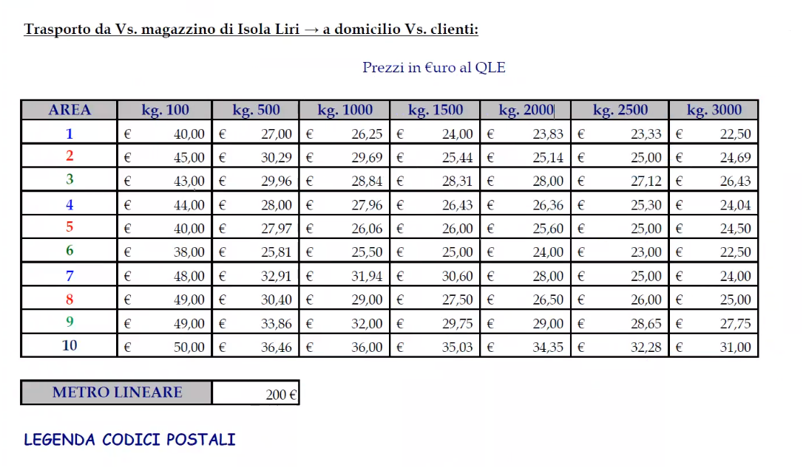

# Attivitá
	- ### NOW Test su calcolaTariffa
	  :LOGBOOK:
	  CLOCK: [2023-11-16 Thu 09:26:12]
	  :END:
		- Riprende {{embed ((6555222a-3562-4770-b8ba-f64a070f7cc7))}}
		- Verificare se sia possibile utilizzare piú fasce con minimo_tassato e cosa succede
		- aggiunta documentazione #doc/code #doc/internal #php/doc/ArrayShape #php/psalm in #[[Progetti/Gsped API/Models/FattureRateModel]]
		  :LOGBOOK:
		  CLOCK: [2023-11-16 Thu 12:07:55]--[2023-11-16 Thu 17:53:10] =>  05:45:15
		  CLOCK: [2023-11-16 Thu 17:53:10]
		  :END:
			- NOW committare subito su ramo **chore**
			  :LOGBOOK:
			  CLOCK: [2023-11-16 Thu 12:07:31]
			  CLOCK: [2023-11-16 Thu 18:57:28]
			  :END:
			- non creare issue JIRA ma solo la PR
		- ### Analisi del codice
			- Perché fa questo test ???
				- ```php
				  // fascia scelta ê l'ultima ???
				  if ($result [0]['fino_a'] == $fasciaPerCalcolo['fino_a'] &&
				  	// minimo tassato coincide con il fino_a della precedente?
				  	// perché fa questo testo ?
				  	$result [1]['fino_a'] == $fasciaPerCalcolo['minimo_tassato']
				  ) { }
				  ```
				- serve davvero confrontare minimo_precedente oppure é solo una precauzione?
				- altra cosa che non capisco é che serve controllare che sia l'ultima
				- altra cosa che non capisco é a che server `minimo_tassato`, detto diversmente ci sono fasce che non sono di esubero che hanno un `minimo_tassato` ? #[[glossary/minimo tassato]]
					- sembra che `minimo_tassato` oltre che per l'esubero venga anche impiegato nel calcolo della singola fascia davvero come il **minimo tassato**, cioé nel calcolo del nolo finito della fascia viene sempre usato per stabilire il massimo tra $$v$$ e $$TF_{min\_tax}(v) $$
					- $$
					  \begin{cases}
					  TF_{min\_tax}(v) : \mathbb{N} \Rightarrow \mathbb{R}  & & & \textrm{trova minimo tassato da fascia per un valore}\ v \\
					  TF_{nolo}(v) : \mathbb{N} \Rightarrow \mathbb{R}  & & & \textrm{trova nolo da fascia per un valore}\ v \\
					  TF_{calc}(v) = \max(v,TF_{min\_tax}(v)) * TF_{nolo}(v) & & & \textrm{calcola il costo della fascia selezionata}
					  \end{cases} $$
					- quindi rimane una certa ambiguitá poiché viene anche utilizzato per gli esuberi con altra funzione, ovvero per determinare la fascia di esubero
		- ### #question
			- Il valore indicato nelle fasce é il peso o il peso volumetrico ???
				- ### RISPOSTA
				  é il peso kg e non il peso volumetrico, viene fatta la selezione della fascia prima per kg e successivamente determinato l'**RPV** si riseleziona la fascia contro il massimo tra peso e peso volumetrico.
		- {:height 641, :width 1090}
		- Possibile soluzione con hack sugli arrotondamenti, potrebbe funzionare ?
			- |ID|LIMITE TOP|NOLO|ARROTONDAMENTO|MINIMO TASSATO|RPV|
			  |--|--|--|--|--|--|
			  |1|3|5||0|300|
			  |2|10|6||0|300|
			  |3|20|8||0|300|
			  |4|30|9||0|300|
			  |5|100|0.5|400|30|300|
			  |6|500|0.8|1000|100|300|
			  |7|1500|1|8500|500|300|
			  |8|99999|1.5|1|99999|300|
- ## Help compilazione
  #INFO
	- ## Attivitá
		- ### Intestazione attivitá
			- **descrive l'attivitá da svolgere** iniziando con un **verbo**, che implica lo svolgimento di una certa azione,
			- alla fine utilizzare dei tag per indicare
				- la sorgente della richiesta, mail, slack etc
				  logseq.order-list-type:: number
				- richiedente, cliente ed eventualmente il corriere
				  logseq.order-list-type:: number
		- ### Sotto blocchi
			- fornire un link ad una #jira/issue é fondamentale da subito perché evita di scrivere in logseq informazioni condivise
			- nei sottoblocchi é lecito avere degli statement che migliorino la rete di conoscenza ma **non devono sostituire o replicare** le informazioni fondamentali in #jira che vanno condivise #Process/Sharing #Process/GTD
			- oggetto della richiesta come il nome del progetto o della codebase
			- la sequenzialitá indica cosa fatto prima o dopo
			- valutare uso di block properties
- ## Riferimenti utili
	- Vai alla guida del processo [[Process/GTD/MyDailyPlanning]] per vederlo o modificarlo
	- Vai al template del [[Templates/Daily Journal]] per vederlo o modificarlo