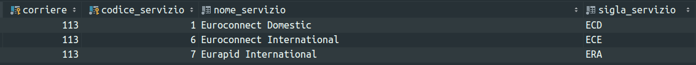

# Attivitá
	- ## Richiesta #people/urso possibilitá inserire listino [[courier/DHL Freight]] #glossary/listino per poi usarlo nella #[[Progetti/Gsped API/Service/Rate Comparativa]]
		- verificando su sandbox si puó vedere anche che al momento sono caricati questi servizi
		  
		- il problema forse era legato al fatto che Marco guardasse nel nazionale; osservando il codice `RateComparativa::getServiziCorriere()` a seconda che la spedizione sia internazionale o meno avviene un filtro dei servizi con spartiacque tra 5 e 6 
		  ```php
		  /* Prendo solo i servizi NAZIONALI od INTERNAZIONALI */
		  if ($internazionale == 0)
		  {
		     $this->db->where('codice_servizio <=', '5');
		  } else {
		     $this->db->where('codice_servizio >=', '6');
		  }
		  ```
		-
		- #### ACTIONs
			- Aggiungere a #improvements/logseq queste sezioni
				- organizzazione dei servizi #gsped eventualmente usando #Instrument/C4
			- Creare un repository o tool #github per le chiamate REST collettivo #improvements/ineffectiveness
				- ad oggi queste informazioni non sono condivise con notevole perdita di tempo
				- parametrizzabili sui vari ambienti tra l'altro
					- valutare anche aspetto sicurezza della cosa,
				- iniziare con un repo dove sono contenute in formato PHPSTorm
				- poi aggiungere anche il formato #Instrument/Postman
				- non sarebbe male aggiungere alla #[[Progetti/Everything App]] app all in one questa funzione
			- Creare una sezione per il miglioramento dei processi #improvements/process
				- un tema interessante legato al processo di Note Taking é la #LogSeq/information-architecture
			- Creare una sezione per salvare i Trick da nerd #Process/Sharing/Howtos
	- ## Riunione Sviluppatori | nuovi processi
		- Argomenti
			- Pair o mobbing programming
				- tutte le attivitá di sviluppo vanno fatte in questa modalitá o solo alcune ?
				- quando pianificare
				- come gestire le interruzioni
				- va deciso su quali attivitá va fatto in fase di analisi scegliendo opportunamente le persone che hanno o non hanno la competenza sul dominio che investito
			- Test integrazione e unit
				- leggere libro per PHPUnit
			- #Sprint di analisi
				- analisi di gruppo
				- in batch, immagino si intenda mettere assieme diversi task
			- Interruzioni da assistenza
				- Gestione dei Bug
					- Analisi occorrenze / insight
					- Messa in cantiere di modifiche strutturali per evitare che si ripresenti
					- Determinazione HotFix vs ChangeRequest
			- Integrazioni JIRA
			- Diagrammi Draw IO
		- Mie osservazioni / domande
			- una cosa é migliorare il processo di sviluppo una cosa é migliorare i processi di gsped
			- ma come monitori il processo ?
			- PHPUnit chiedere a BnB aiuto sul layer
			- download schema con comand
			-
			-
	- ### Testo descrittivo attivitá 1
	  client:: fill
	  courier:: fill
	  requester:: fill
	  channel:: fill
	  tracking:: fill
		- attivitá log statement 1
		- attivitá log statement 2
		- attivitá log statement ...
		- attivitá log statement N
- ## Help compilazione
  #INFO
	- ## Attivitá
		- ### Intestazione attivitá
			- **descrive l'attivitá da svolgere** iniziando con un **verbo**, che implica lo svolgimento di una certa azione,
			- alla fine utilizzare dei tag per indicare
				- la sorgente della richiesta, mail, slack etc
				  logseq.order-list-type:: number
				- richiedente, cliente ed eventualmente il corriere
				  logseq.order-list-type:: number
		- ### Sotto blocchi
			- fornire un link ad una #jira/issue é fondamentale da subito perché evita di scrivere in logseq informazioni condivise
			- nei sottoblocchi é lecito avere degli statement che migliorino la rete di conoscenza ma **non devono sostituire o replicare** le informazioni fondamentali in #jira che vanno condivise #Process/Sharing #Process/GTD
			- oggetto della richiesta come il nome del progetto o della codebase
			- la sequenzialitá indica cosa fatto prima o dopo
			- valutare uso di block properties
- ## Riferimenti utili
	- Vai alla guida del processo [[Process/GTD/MyDailyPlanning]] per vederlo o modificarlo
	- Vai al template del [[Templates/Daily Journal]] per vederlo o modificarlo