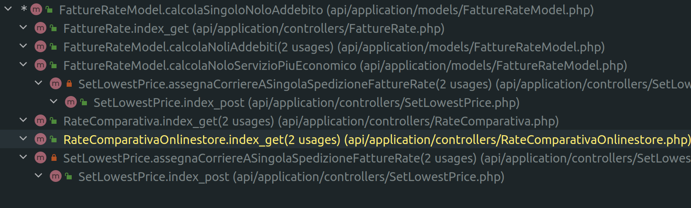
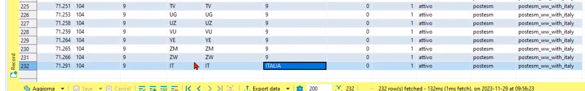
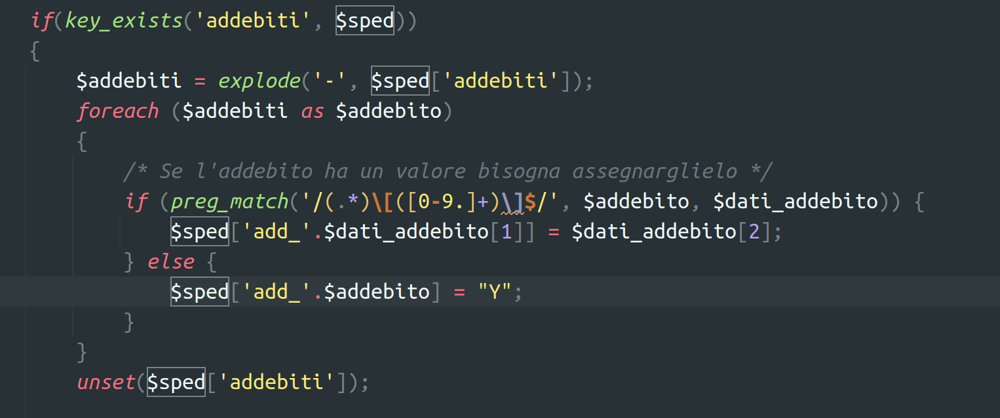

# Attivitá
	- ### NOW Problema #courier/DHL san marino va visto come internazionale e non nazionale
	  id:: 655db840-b7d8-4ed4-9c6d-2d0d948d816b
	  collapsed:: true
	  :LOGBOOK:
	  CLOCK: [2023-12-04 Mon 11:22:34]
	  :END:
		- per stabilire se una spedizione é internazionale é necessario considerare anche il corriere #business-rule #Models
			- attenzione perché questa é logica deputata ai model sui corrieri pertanto capire come implementare interfaccia chiedere a #people/ballerini #people/alessio-bracco #issue/code/refactoring
		- nel codice il controllo nelle #[[model/fatturazione/RateComparativa]] va posticipato solo dopo il recupero del contratto al fine di avere informazione sul corriere
			- quindi i contratti non possono essere prelevati in anticipo, vanno presi tutti
			- attenzione perché `checkInternazionale` viene usato in altri punti dove il corriere potrebbe non essere disponibile
		- La selezione del corriere piú economico potrebbe non rilevare DHL essendo che `checkSpedInternazionale` non riceve `$corriere` e quindi potrebbe escludere il contratto #courier/DHL a priori , vedere `calcolaNoloServizioPiuEconomico` e `calcolaSingoloNoloAddebito` #NOTICE
		- Cercare `SetLowerPriceImproved == 1`, nostro obiettivo é 2 che usa la rate comparativa ... il resto é codice vecchio quindi in teoria #people/fabio-alessio
		- non posso rifattorizzare `ClientModel::listIds` poiché é indicizzato per corriere e supporta un solo valore per ogni corriere.
		- notare come di nuovo si ripresenti problema degli #issue/code/array-shape #LEARNED, la variabile $sped andrebbe modellata quantomeno con un oggetto che abbia un getter di un interfaccia per capire facilmente i suoi usi, es getInput(..field_name...)
		- c'é comunque sempre un desiderio a sovra-semplificare #issue/behaviour/oversimplification
		- Analizzare chiamate a `FattureRateModel::calcolaSingoloNoloAddebito`
			- 
			- DONE SetLowestPriceImproved: ok viene assegnato nel loop
			- DONE SetLowestPrice: vecchio sistema aggiunge anche corriere
			  :LOGBOOK:
			  CLOCK: [2023-11-28 Tue 17:09:20]--[2023-11-28 Tue 17:09:21] =>  00:00:01
			  :END:
			- DONE `RateComparativaOnlinestore`: sembra non essere piú utilizzata ma meglio chiedere #question
			  :LOGBOOK:
			  CLOCK: [2023-11-28 Tue 17:41:00]--[2023-11-29 Wed 12:21:22] =>  18:40:22
			  :END:
				- riportato domanda in #jira
		- Documentare logica che usa la #model/fatturazione/RateComparativa per capire quale `client_id` utilizzare , se invoiced oppure il client normale #action/doc #issue/doc/missing
			- notare che negli `api_field` la validazione controlla la relazione tra client id e accesso per verificare accesso
		- Dobbiamo anche rivedere contenuto di #model/fatturazione/template_zone_corrieri
		  :LOGBOOK:
		  CLOCK: [2023-11-29 Wed 10:01:41]
		  :END:
			- 
			- zona ITALIA va lasciato o tolto?
		- DONE Ho rilevato un problema in `\App\models\FattureRateModel::calcolaNoliAddebiti` sembra non essere usato  #issue/code #issue/code/refactoring #issue/code/deprecated #action/refactor
		  :LOGBOOK:
		  CLOCK: [2023-11-29 Wed 10:37:45]--[2023-11-29 Wed 12:21:48] =>  01:44:03
		  :END:
			- segnalato in card Jira
	- ### DONE Richieste priscilla verifica elaborazione #client/Bonzai
	  id:: 655db840-073b-4894-8a0e-155e6a827e9d
	  collapsed:: true
	  :LOGBOOK:
	  CLOCK: [2023-11-22 Wed 09:57:11]--[2023-11-24 Fri 22:25:39] =>  60:28:28
	  CLOCK: [2023-11-24 Fri 22:25:41]--[2023-11-24 Fri 22:25:41] =>  00:00:00
	  CLOCK: [2023-11-24 Fri 22:25:42]--[2023-11-24 Fri 22:25:43] =>  00:00:01
	  CLOCK: [2023-11-29 Wed 09:25:37]--[2023-11-29 Wed 16:36:51] =>  07:11:14
	  :END:
		- Vedi conversazione su https://gsped.slack.com/archives/D051G6YB5UJ/p1700564283205749
		- DONE creare card in Jira #action/task/new https://gsped.atlassian.net/browse/FT-118
		  collapsed:: true
		  :LOGBOOK:
		  CLOCK: [2023-11-22 Wed 12:43:34]--[2023-11-22 Wed 12:43:35] =>  00:00:01
		  :END:
			- [FT-118|Bonzai | BRT : problemi elaborazione fattura ](https://gsped.atlassian.net/browse/FT-118)
			  id:: 65611654-9964-414b-8226-95900a085cab
		- DONE riportare in #LogSeq la logica del #business-rule/calcolo-tariffario chiave primaria e secondaria e questo problema
		  :LOGBOOK:
		  CLOCK: [2023-11-22 Wed 16:50:26]
		  :END:
		- DONE aprire una isse dedicata
		  :LOGBOOK:
		  CLOCK: [2023-11-24 Fri 22:24:17]--[2023-11-24 Fri 22:24:17] =>  00:00:00
		  :END:
		- #### Riga 24
		  collapsed:: true
		  ho scoperto che l'addebito **colli non compatibili** viene invocato con la sintassi `i[1.9]` che di fatto viene innescata nel #[[Progetti/Motore di Fatturazione]] dal momento che su un addebito la colonna `as_invoice` é indicata a 1, viene preso  il valore addebito dalla fattura #business-rule/calcolo-tariffario sarebbe da documentare #doc #action/doc #model/fatturazione/FattureRate
			- Notare come esista una notazione `add_"addebito"` = valore, che potrebbe essere supportata anche da altri endpoint ? in teoria dalla comparativa non viene mai utilizzato #doc/code #Instrument/php/phpdoc
			- Inoltre `\App\models\FattureRateModel::checkAddebiti` é la funzione che li analizza nel formato `add_`
			- Il seguente codice nella #model/fatturazione/FattureRate accetta tali parametri in questo formato e li passa alle funzioni interne
				- 
			- DONE Mettere in schedule update VIEW [[model/fatturazione/fatture_corrieri_tipiaddvari]]
				- aggiornato nella notte di [[2023-11-27 Monday]] correttamente
		- #### Riga 27
			- DONE Analizzare ultimo problema segnalato
			  :LOGBOOK:
			  CLOCK: [2023-11-28 Tue 19:53:05]--[2023-12-04 Mon 11:22:50] =>  135:29:45
			  :END:
			- Non sarebbe male trovare un posto dove salvare in maniera condivisa le richieste #Instrument/Postman #topic/REST #idea💡 #issue/sharing
		- Interessante anche il concetto di `last_cons` che permette di gestire ordine di calcolo degli addebiti percentuali #business-rule/calcolo-tariffario #model/fatturazione/costi_accessori_master #model/fatturazione/costi_accessori_local #model/fatturazione/fatture_corrieri_tipiaddvari
		- DONE #people/priscilla mi ha chiesto di variare il formato della mappatura #client/Bonzai #courier/BRT
		  :LOGBOOK:
		  CLOCK: [2023-11-28 Tue 10:00:52]--[2023-11-29 Wed 16:36:48] =>  30:35:56
		  :END: