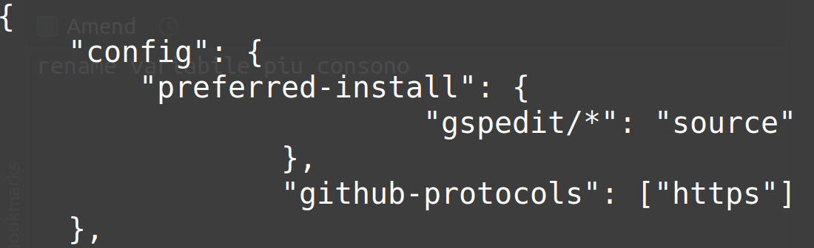
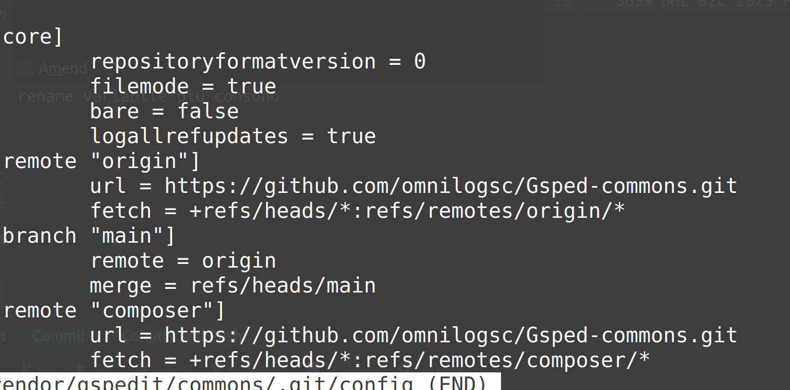

# Attivitá
	- ### #client/postesm fare un test in locale di fix_dhl_microstate
		-
	- DONE Mandare info config #Instrument/IDE/PHPStorm #people/ballerini #people/alessio-bracco #Instrument/php/composer
		- {:height 227, :width 718}
		- 
		- Ho anche inviato a #people/alessio-bracco il link https://github.com/MatteoOreficeGS/onboarding/blob/main/daily-activity-logs/2023-04-11_validate-dev-environment.md
		- ho anche consigliato plugin per workflow locale [https://github.com/gossi/composer-localdev-plugin](https://github.com/gossi/composer-localdev-plugin)
- ## Riferimenti utili
	- Vai alla guida del processo [[Process/GTD/MyDailyPlanning]] per vederlo o modificarlo
	- Vai al template del [[Templates/Daily Journal]] per vederlo o modificarlo