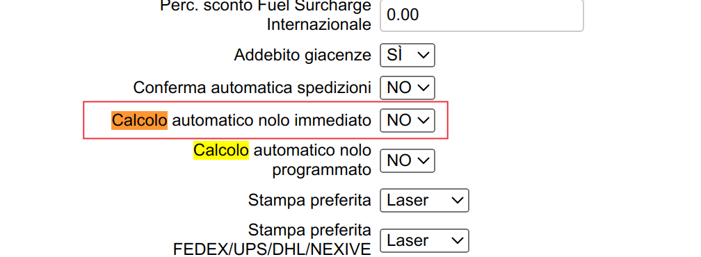

# Attivitá
	- ### #courier/DHL fix per San Marino continua ((655db840-b7d8-4ed4-9c6d-2d0d948d816b))
		- `checkSpedImport` forza il calcolo di sender, quindi non viene fatto il max tra tariffa andata e ritorno
		- DONE fare test in locale con tariffe e listini #client/postesm #courier/DHL
		  :LOGBOOK:
		  CLOCK: [2023-11-24 Fri 22:33:17]--[2023-11-24 Fri 22:34:51] =>  00:01:34
		  :END:
		- DONE creare issue in #action/task/new #jira [FT-125|DHL: fix microstate per San Marino](https://gsped.atlassian.net/browse/FT-125)
	- Richiesta aiuto #people/diego elaborazione 16020 #client/ubik #courier/PDB #[[Progetti/Motore di Fatturazione]]
		- DONE inserire qui riferimenti all PR di fix [FT-123|Il confronto codice addebito in  `costi_accessori_master` e il codice indicato nella fattura avviene su case diversi](https://gsped.atlassian.net/browse/FT-123)
		  :LOGBOOK:
		  CLOCK: [2023-11-24 Fri 14:08:37]--[2023-11-24 Fri 22:28:53] =>  08:20:16
		  :END:
	- LATER Chiedo a #people/jhonathan cosa sia **Calcolo automatico nolo immediato** che memorizza il flag `clienti.dhl_controllo_costo` #courier/DHL #business-rule #model/core/cliente #doc/domain
	  :LOGBOOK:
	  CLOCK: [2023-12-04 Mon 11:04:11]--[2023-12-04 Mon 11:05:23] =>  00:01:12
	  :END:
		- Ho creato un task [MOPRIV-59|Creazione KB per Gsped su dominio](https://gsped.atlassian.net/browse/MOPRIV-59)
		- LATER Creare una sorta di piano o ripartizione oraria per i tipi di attivitá durante la giornata e poi un assistente per ricordare #[[Process/Tasks Management/GTD/My]]
		- vedi [link slack](https://gsped.slack.com/archives/C9EKWE724/p1700818911488179)
			- 
			- 
			- 
		- riferimenti in gitbook https://app.gitbook.com/o/-LhpbdRCZplUyqAg775u/s/-LtxcaEqtn4Itl_8d5zs/clienti/dhl/dhl-express#text-configurazione-nuovo-cliente
	- comprendere meglio e trascrivere un po' di queste #business-rule legate al #business-rule/calcolo-tariffario
		- concetto del max tra tratte inverse per nolo, come mai nella `RateComparativa` forza sempre RCPT ? #action/question
		- concetto dell'import, perché in quel caso si prende il costo della spedizione verso il mittente? #action/question
		- Discussione con #people/priscilla https://gsped.slack.com/archives/D051G6YB5UJ/p1700834456843549 legata alla direzione anche utile