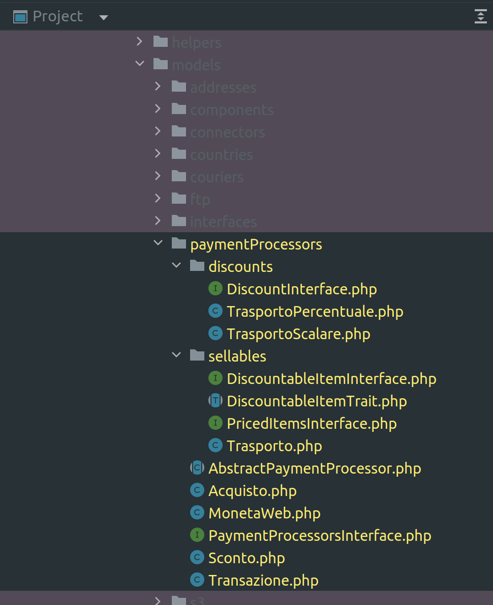

type:: [[LS/Page/Journal]]

- # Attivitá
  query-table:: true
	- Test Action
	  type:: #action/refactor
	  description:: mio prova
	- ## Smaltimento coda jira
		- [RA-6|Attivazione Ricalcola - Elledi Spedizioni](https://gsped.atlassian.net/browse/RA-6) Rilevato fallimento di processo #issue/failure #issue/process #client/elledispedizioni #issue/sharing #issue/out-of-sync
			- la card riporta cose da fare che sono giá fatte #action/question e non si capisce lo stato della card
			- conversazione slack dove chiedo se qualcuno ha lumi https://gsped.slack.com/archives/D051G6YB5UJ/p1694434815286299
			- LATER in caso non si ottenga risposta chiudere attivitá
			  SCHEDULED: <2023-12-05 Tue>
			  :LOGBOOK:
			  CLOCK: [2023-11-30 Thu 18:43:26]--[2023-11-30 Thu 18:43:30] =>  00:00:04
			  :END:
		- Rilevato fallimento di processo #issue/failure #issue/process
			- vedere conversazione, la card non é aggiornata vedi slack https://gsped.slack.com/archives/D051JLRCJS0/p1701343656104289
			- qui ho fallito io, peró come sempre sono l'unico ad aggiornare le card
	- ## Tramutati da #jira
	  collapsed:: true
		- Mettere in log seq questa issue `ClientModel::list_access` contiene un bug su caso limite #model/core/ClientModel #issue/code
		- Svincolo giacenza TNT: convertire ad utf-8 la risposta da content-type #courier/TNT #topic/giacenza #topic/file-format #issue/code
			- questo problema si manifesta perche il content-type di risposta non é utf-8, dunque nel log possono trovarsi problemi di caratteri imprevisti, segnalato da Jacopo, il problema comunque non é bloccante perché comunque le chiamate funzionano a meno dell giacenze.id_corriere
	- ## Analisi di oggi [[2023-11-30 Thursday]]
		- Registrazione: **2023-11-30 14-13-06.mkv**
		- [AN-32|Integrazione provider pagamento Ingenico](https://gsped.atlassian.net/browse/AN-32) #Process/SDC/analysis
		  collapsed:: true
		  :LOGBOOK:
		  CLOCK: [2023-11-30 Thu 15:22:39]
		  :END:
			- ci comprano i resi, ovvero servizi
			- https://apireference.connect.worldline-solutions.com/s2sapi/v1/en_US/index.html?paymentPlatform=GLOBALCOLLECT&paymentPlatform=GLOBALCOLLECT
			- A noi interessa modalitá la **Hosted Checkout**
			- dati sandbox nella card con OTP
			- Vedere interfaccia payment processor
			- vedere sandbox [https://docs.connect.worldline-solutions.com/documentation/sdk/server/php/](https://docs.connect.worldline-solutions.com/documentation/sdk/server/php/)
			- #### Analisi MonetaWeb per il codice esistente
			  collapsed:: true
				- 
				- Attuali funzioni Nexi:
					- funzione classica di checkout one-time
					- no sottoscrizioni ricorrenti
					- ad oggi no test preliminare del credito
					- no rimborsi
					- vedere in legacy i traits utilizzato
			- #### Domande
			  collapsed:: true
				- capire ordine degli eventi
				- sapere quale é il flusso e come funziona ora
			- #### NOW Actions
			  SCHEDULED: <2023-12-04 Mon>
			  :LOGBOOK:
			  CLOCK: [2023-11-30 Thu 15:31:51]
			  :END:
				- Analizzare la documentazione a partire da https://docs.connect.worldline-solutions.com/
				  :LOGBOOK:
				  CLOCK: [2023-11-30 Thu 15:31:02]
				  CLOCK: [2023-11-30 Thu 15:31:14]
				  :END:
				- Sintetizzare in una pagina di brainstorming collegata allo sprint [[Sprints/Analisi Hosted Checkout Ingenito]]
		- ### Microservizi corrieri
		- ### Generazione doc interna #doc/internal #Instrument/php/phpdoc
			- discussione https://laracasts.com/discuss/channels/general-discussion/anybody-using-auto-generated-api-documentation
			- https://phpdox.net/
			- https://www.phpdoc.org/
			- [doxygen](https://www.doxygen.nl/index.html)
			-
	- ## Riflessioni processo analisi
		- le metto in un documento dedicato denominato [[Miglioramento processo di analisi]]
- # Aiuto compilazione
  Se hai bisogno di aiuto nelle compilazioni ecco alcuni riferimenti utili, questi blocchi sono inclusi con embed per evitare duplicazioni
- {{embed ((6565c304-9cba-4238-91e6-36a5a4b45930))}}
- {{embed ((6565c304-72f1-40e2-b2ac-a2eab69b4998))}}
- {{embed ((6565c304-fbc2-4931-ab16-96384d8543be))}}