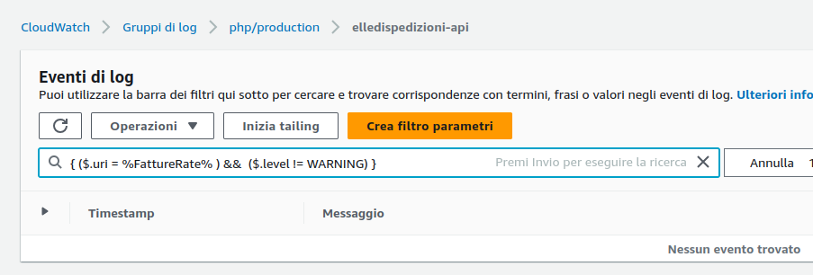
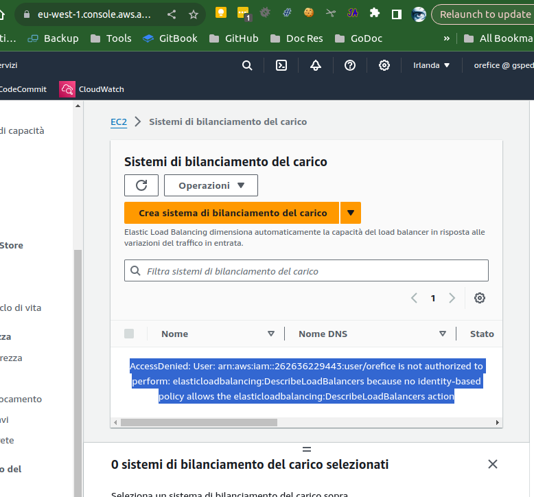
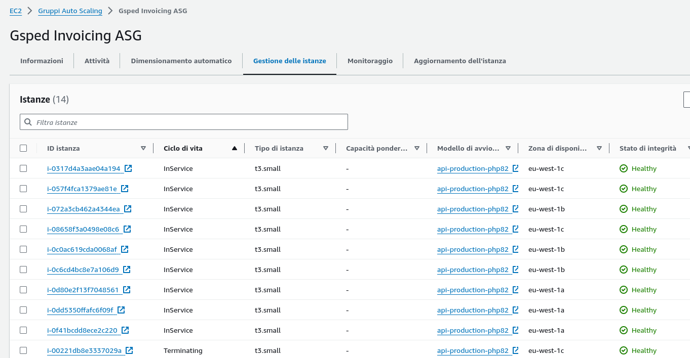
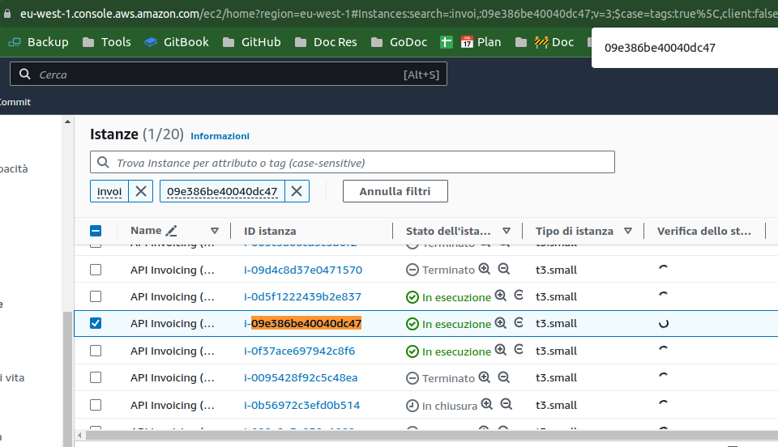

type:: [[LS/Page/Journal]]

	- # Attivitá
		- ### Problema #client/elettrosud #courier/GLS #people/priscilla
			- https://gsped.slack.com/archives/D051G6YB5UJ/p1701766302921609 vedi discussione slack
			- DONE creare card #action/task/new
			  :LOGBOOK:
			  CLOCK: [2023-12-05 Tue 09:54:12]--[2023-12-05 Tue 18:09:30] =>  08:15:18
			  :END:
				- creata
		- Continua ⏩️
		  {{embed ((656ed40b-6b5f-406f-86e7-04cbc3ad72ff)) }}
		- ### Discussione con #people/ricci #people/valerio
			- aggiungere una checklist
			- commentare il documento https://gsped.atlassian.net/wiki/spaces/~19276049/pages/1102970885/Standup
		- ### Problema #[[Progetti/Motore di Fatturazione]]
		  tags:: #issue/failure/api, #tools/cloudwatch, #topic/logs
			- Nella mattina c'e stata una sfilza di errori 500 #issue/outage, #topic/500, #issue/failure/api
			- #### Alcune immagini 🖼️ su come analizzare i log in #tools/cloudwatch
			  tags:: #topic/logs, #troubleshooting, #doc/howtos #image, #topic/logs/analisi
			  collapsed:: true
				- 
				- 
				- 
				- 
			- LATER [[2023-12-06 Wednesday]] verificare se ci siano ulteriori problemi
			  SCHEDULED: <2023-12-06 Wed>
		-
	- # Aiuto compilazione
	  Se hai bisogno di aiuto nelle compilazioni ecco alcuni riferimenti utili, questi blocchi sono inclusi con embed per evitare duplicazioni
	- {{embed ((6565c304-9cba-4238-91e6-36a5a4b45930))}}
	- {{embed ((6565c304-72f1-40e2-b2ac-a2eab69b4998))}}
	- {{embed ((6565c304-fbc2-4931-ab16-96384d8543be))}}