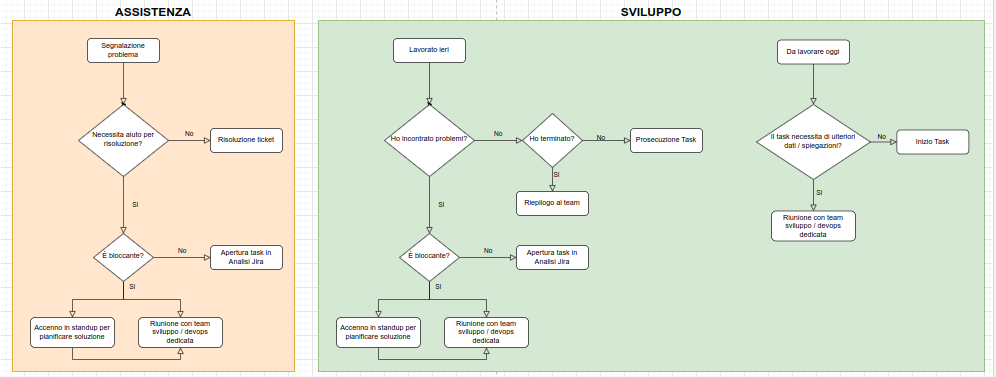
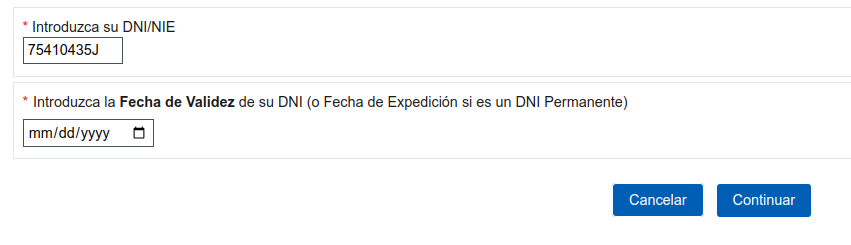

type:: [[LS/Page/Journal]]

	- # Stand-Up domande
	  collapsed:: true
		- DONE Vorrei aiuto per capire se la `ci_error_log` su http://invoicing.gsped.it logga su cloudwatch e con che istanza
		  id:: 65702709-a27a-47a5-8a50-bd1e4ad5dad8
			- Non c'e molto da fare ma Valerio ha confermato che logga come le altre istanze vedere [FT-141| FattureRate: Disservizio errori 500 del 05/12/2023](https://gsped.atlassian.net/browse/FT-141) #tools/cloudwatch
			  id:: 65702df2-6915-4140-8c08-e17a7b508c47
	- # Attivitá
		- ### Riprendo ⏩️
		  {{embed ((656f5a7e-cd14-43c8-b67b-15909aadb4d8))}}
		- ### NOW Guardare diagramma fatto da #people/ricci 
		  tags:: #Process/SDC/Analisi, #media/diagrams
		  :LOGBOOK:
		  CLOCK: [2023-12-06 Wed 10:11:53]
		  :END:
			- 
			  https://app.diagrams.net/#G1Hpt0FeNSfG-OTYIeEGBhOePn7fZ3GBzU
			- LATER fare osserazioni
		- ### Riunione sviluppo di oggi
			- [AN-7|Gestione tipo collo in modo generico](https://gsped.atlassian.net/browse/AN-7) #people/ricci]
			  tags:: topic/collo, #business-rule/gestione-tipo-colli, #topic/courier-logic
			- [AN-63|Censimento feature corrieri](https://gsped.atlassian.net/browse/AN-63) #people/valerio
				- inizialmente viene fatto un elenco fisico delle funzioni
				- guardare il documento creato da valerio
			- [AN-33|Creazione sistema verifica codici fiscali / piva  agnostico](https://gsped.atlassian.net/browse/AN-33) #people/valerio
			  collapsed:: true
				- capire che tipo di chiamate fa al quel servizio della ricerca
				- usare codice K1234567L
				- https://www2.agenciatributaria.gob.es/wlpl/BUCV-JDIT/AutenticaDniNieContrasteh?ref=%2Fwlpl%2FOVCT-CXEW%2FObtenerPin%3Fref%3D%252Fwlpl%252FBUGC-JDIT%252FCnec
				- Questo form triggera il metodo seguente
				  
				- La validazione NIF é sul client, ma comunque portabile
				  ```javascript
				  function validarNif() {
				  	jQuery('#errorNif').html('');
				  	var nif = String('000000000' + jQuery('#NIF')[0].value).slice(-9)
				  			.toUpperCase();
				  	var oNif = $NIF(nif);
				  	if (oNif.esValido() && oNif.esPersonaFisica()) {
				  		document.getElementById('SOPORTE').value = '';
				  		document.getElementById('FECHA').value = '';
				  		var letra = nif[0];
				  		jQuery('#ayudaFechaValidez_oculta').removeClass('oculto');
				  		jQuery('#ayudaFechaExpedicion_oculta').removeClass('oculto');
				  	}
				    /// ............
				  }
				  ```
				- ho aggiornato la pagina di analisi https://gsped.atlassian.net/wiki/spaces/Sviluppi/pages/1097564174/Validazione+p.iva+c.f.
			- {{embed ((656daff2-fb5d-4c3a-a3b1-fadda2aa9aab))}}
	- # Aiuto compilazione
	  Se hai bisogno di aiuto nelle compilazioni ecco alcuni riferimenti utili, questi blocchi sono inclusi con embed per evitare duplicazioni
	- {{embed ((6565c304-9cba-4238-91e6-36a5a4b45930))}}
	- {{embed ((6565c304-72f1-40e2-b2ac-a2eab69b4998))}}
	- {{embed ((6565c304-fbc2-4931-ab16-96384d8543be))}}