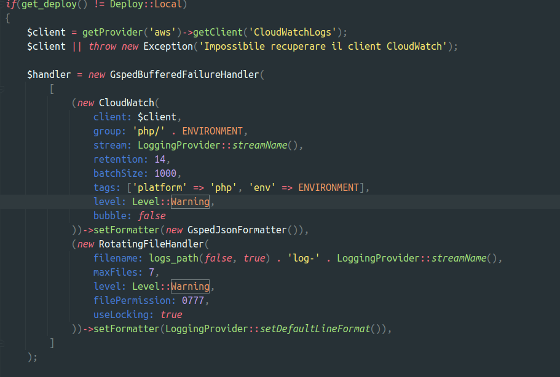

type:: [[LS/Page/Journal]]

	- # Stand-Up Topics
	  collapsed:: true
		- Seur sono cambiate le API #topic/compatibility
			- #idea💡creare un processo che monitora i cambiamenti delle API esterne
			- progettare un flusso per la verifica di questi cambi. #[[Progetti/Everything App]], #action/design #issue/feature/missing
		- Rilevato fallimento di processo su approvazione dell pull request
		  tags:: #topic/pull-request, #issue/failure, #Process/SDC/code-review, #[[Process/Process Improvement]]
			- la mia PR é li in attesa e nessuno la ha guardata....
			- sarebbe il caso che comunque ci fossero delle notifiche #action
			- sarebbe il caso di poter settare una due date #action
		- Livello di Log minimo in API ?? coinvolgere anche
		  tags:: #people/fabio-alessio , #topic/logs/analisi
		  
			- Risposta scrivere in S3 #issue/code/refactoring #Instrument/AWS/S3
				- usare un monolog in ram
				- unsare un buffer
				- register_shutdown_function
				- iniettare un uuid in fatturazione
				- NOW Creare una card in Jira #action/task/new #issue/code/refactoring
				  :LOGBOOK:
				  CLOCK: [2023-12-07 Thu 09:48:23]
				  :END:
	- # Attivitá
	  {{renderer :smartblock, resume-task, Resume Task ⏩️, false}} {{renderer :smartblock, new-task, New Task ➕, false}}
		- ### Mi prendo 5 minuti in pausa per un suggerimento su #tools/blog
		  tags:: topic, topic, topic
			- DONE riportare il commento a #people/valerio su #Instrument/slack
		- ### NOW Censire osservazioni di #people/casetta
		  :LOGBOOK:
		  CLOCK: [2023-12-07 Thu 09:44:00]
		  :END:
			- https://mail.google.com/mail/u/0/#inbox/FMfcgzGwHxzLWwmzwPMrjqWmJnfQDBCN
			- include nell'analisi i commenti
		- ### NOW Censire ticket per #priscilla #courier/fercam #client/unifarco
		  :LOGBOOK:
		  CLOCK: [2023-12-07 Thu 08:46:11]
		  :END:
			- https://gsped.slack.com/archives/D051G6YB5UJ/p1701875153247059
		- ### Discussione standup
			- modo di standup
			- come si raccolgono i bug oggi ?
			- come tracciare quante volte viene disturbato valerio e capire
			- NOW crea un documento di sintesi per riunione prossima settimana
			  SCHEDULED: <2023-12-07 Thu>
			  :LOGBOOK:
			  CLOCK: [2023-12-07 Thu 15:12:57]
			  :END:
				- creare una sintesi del documento per presentare
				- mostrare i bottle neck di processo
				- fare degli esempi su fallimenti del processo SU con casi reali 2-3 esempi
				- fare un elenco di possibili azioni da implementare e votandoli magari democraticamente per i prossimi SU
	- # Aiuto compilazione
	  Se hai bisogno di aiuto nelle compilazioni ecco alcuni riferimenti utili, questi blocchi sono inclusi con embed per evitare duplicazioni
	- {{embed ((6565c304-9cba-4238-91e6-36a5a4b45930))}}
	- {{embed ((6565c304-72f1-40e2-b2ac-a2eab69b4998))}}
	- {{embed ((6565c304-fbc2-4931-ab16-96384d8543be))}}