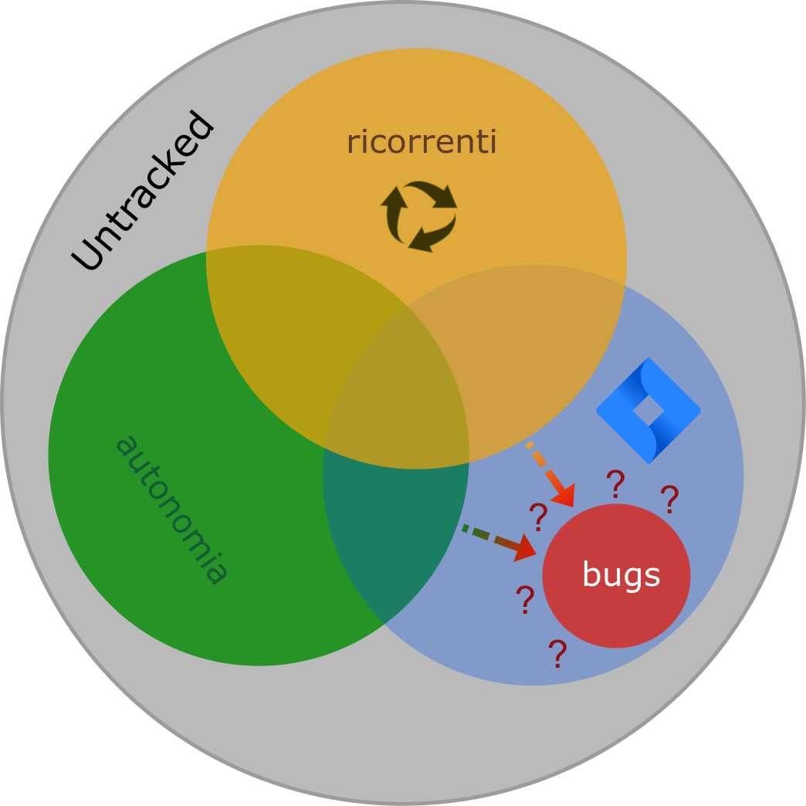
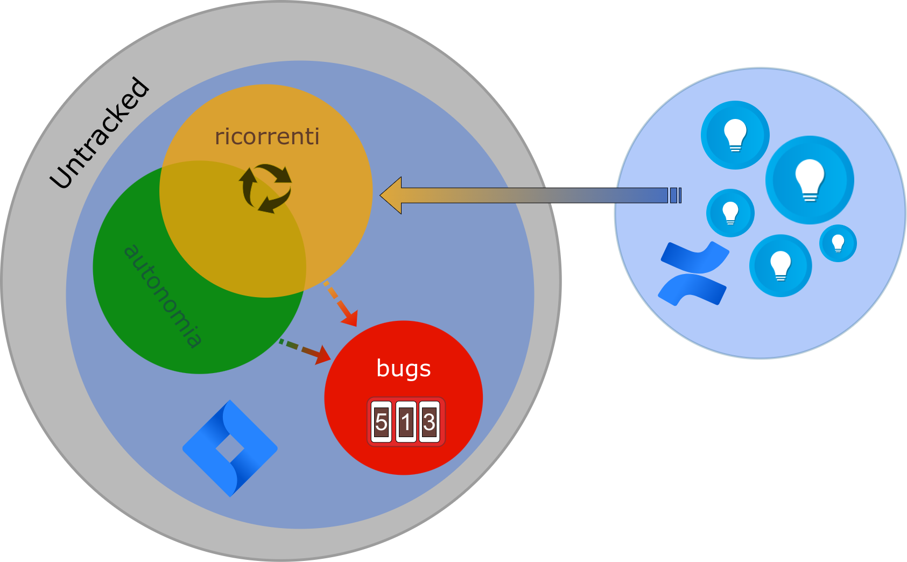

type:: [[LS/Page/Journal]]

	- # Stand-Up Topics
	  collapsed:: true
		- Seur sono cambiate le API #topic/compatibility
			- #idea💡 un processo che monitora i cambiamenti delle API esterne
			- progettare un flusso per la verifica di questi cambi. #[[Progetti/Everything App]], #action/design #issue/feature/missing
		- Rilevato fallimento di processo su approvazione dell pull request
		  tags:: #topic/pull-request, #issue/failure, #Process/SDC/code-review, #[[Process/Process Improvement]]
			- la mia PR é li in attesa e nessuno la ha guardata....
			- sarebbe il caso che comunque ci fossero delle notifiche #action
			- sarebbe il caso di poter settare una due date #action
		- Livello di Log minimo in API ?? coinvolgere anche
		  tags:: #people/fabio-alessio , #topic/logs/analisi
		  
			- Risposta scrivere in S3 #issue/code/refactoring #Instrument/AWS/S3
				- usare un monolog in ram
				- unsare un buffer
				- register_shutdown_function
				- iniettare un uuid in fatturazione
				- WAITING Creare una card in Jira #action/task/new #issue/code/refactoring
				  :LOGBOOK:
				  CLOCK: [2023-12-07 Thu 09:48:23]
				  :END:
	- # Attivitá
	  {{renderer :smartblock, resume-task, Resume Task ⏩️, false}} {{renderer :smartblock, new-task, New Task ➕, false}}
		- ### Mi prendo 5 minuti in pausa per un suggerimento su #tools/blog
		  tags:: topic, topic, topic
			- DONE riportare il commento a #people/valerio su #Instrument/slack
		- ### LATER Censire osservazioni di #people/casetta
		  :LOGBOOK:
		  CLOCK: [2023-12-07 Thu 09:44:00]--[2023-12-19 Tue 15:29:07] =>  293:45:07
		  :END:
			- usare card
			- https://mail.google.com/mail/u/0/#inbox/FMfcgzGwHxzLWwmzwPMrjqWmJnfQDBCN
			- include nell'analisi i commenti
		- ### Discussione standup
			- modo di fare gli standup, riepilogo punti salienti
			- divagazione: come si raccolgono i bug oggi ?
				- non a
			- come tracciare quante volte viene disturbato valerio e capire
			- DONE crea un documento di sintesi per riunione prossima settimana
			  SCHEDULED: <2023-12-07 Thu>
			  :LOGBOOK:
			  CLOCK: [2023-12-07 Thu 15:12:57]--[2023-12-07 Thu 15:18:38] =>  00:05:41
			  CLOCK: [2023-12-07 Thu 21:03:04]--[2023-12-14 Thu 14:14:18] =>  161:11:14
			  :END:
				- creare una sintesi del documento per presentare in pubblico
				- mostrare i bottle neck di processo direttamente sul flow chart
				- fare degli esempi su fallimenti del processo SU con casi reali (2-3 esempi)
				- fare un elenco di possibili azioni da implementare e votandoli magari democraticamente per i prossimi SU
					- lo scopo é far dire alla gente ok dalla prossima settimana proviamo a mettere in atto almeno una azione pratica per migliorare
				- applicare le azioni ai precedenti esempi per far capire il giusto flusso
			- ## Analisi insiemistica
			  tags:: #media/diagrams, #issue/jira/untracked
				- ### Situazione odierna `0.9`
				  {:height 468, :width 468}
					- Sotto-insieme **JIRA**: sono le issue censite in #JIRA
						- > ⚠️ Non tutte le issue sono centite in #JIRA
					- Sotto-insieme **autonomia**: risolvibili in autonomia senza scalare nel team
					- Sotto-insieme **ricorrenti**: che si ripresentano nel tempo
					- Sotto-insieme **bug**: issue che sono state riconosciute come bug
						- > ⚠️ Non é chiaro quali e quante delle issue abbiano generato un #issue/bug dedicato
				- ### Situazione migliorata `0.9.4`
				  {:height 438, :width 662}
					- Sotto-insieme **JIRA**: sono le issue censite in #JIRA
					  > ✅️ **Tutte le issue** sono ora tracciate in #JIRA 1️⃣
					- Sotto-insieme **bugs**: il numero di bugs che viene generato da altre issue
					  > ✅️ i bugs vengono ora generati e collegati direttamente alla issue che li ha generati  2️⃣
					  > ✅️ Le soluzioni ai bugs ricorrenti vengono documentate e taggate con delle parole chiave per facilitarne la ricerca 3️⃣
					- Sotto-insieme **autonomia**: risolvibili in autonomia senza scalare nel team
					- Sotto-insieme **ricorrenti**: che si ripresentano nel tempo
					  > ✅️ La risoluzione delle issue  **ricorrenti** attinge da una knowledge base che viene costantemente aggiornata per offrire soluzioni specifiche a problemi simili. 4️⃣
	- # Aiuto compilazione
	  Se hai bisogno di aiuto nelle compilazioni ecco alcuni riferimenti utili, questi blocchi sono inclusi con embed per evitare duplicazioni
	- {{embed ((6565c304-9cba-4238-91e6-36a5a4b45930))}}
	- {{embed ((6565c304-72f1-40e2-b2ac-a2eab69b4998))}}
	- {{embed ((6565c304-fbc2-4931-ab16-96384d8543be))}}