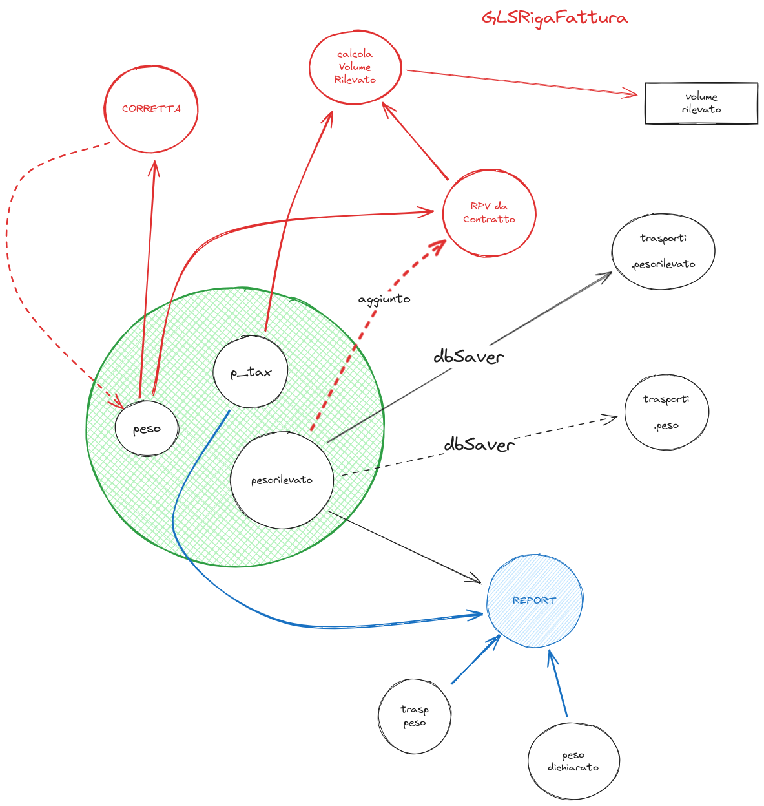

# Stand-Up Topics
	- topic 1
	- topic 1
	- topic 3
- # Attivitá
  {{renderer :smartblock, resume-task, Resume Task ⏩️, false}} {{renderer :smartblock, new-task, New Task ➕, false}}
	- ### Riprendo Task analizzo richieste PR san marino ⏩️
	  {{embed ((655db840-b7d8-4ed4-9c6d-2d0d948d816b)) }}
	- ### Analizzo ticket tnt svincolo assistenza
	  tags:: topic, topic, topic
		- NOW https://gsped.atlassian.net/browse/AT-34632 capire se posso aiutare #courier/TNT #client/stc
		  :LOGBOOK:
		  CLOCK: [2023-12-13 Wed 10:11:17]--[2023-12-13 Wed 10:11:18] =>  00:00:01
		  CLOCK: [2023-12-13 Wed 10:11:20]
		  :END:
		- vedere commento di #people/urso https://gsped.slack.com/archives/D0519JJLB6J/p1702481527919209
	- ### Riprendo Task problema unifarco fercam ⏩️
	  {{embed ((65771536-e4a9-41a8-890b-29159b01c847)) }} {{embed ((65771537-762c-492c-931f-630007bdc82d)) }}
	- ### NOW Richiesta aiuto #people/fabio-alessio #client/Stampasi #courier/GLS 
	  tags:: #[[Progetti/Motore di Fatturazione]], #issue/bug, #issue/design
	  :LOGBOOK:
	  CLOCK: [2023-12-13 Wed 17:19:13]
	  :END:
		- LATER bisogna riportare sul file degli opener la modifica
		  :LOGBOOK:
		  CLOCK: [2023-12-13 Wed 17:19:03]
		  :END:
		- #model/fatturazione/GlsRigaFattura usa `p_tax` per memorizzare il peso volumetrico ( ovvero $$p_{tax} = volume * rpv$$) quando questo dovrebbe rappresentare nel programma il peso tassato, ovvero il max tra **peso** e **peso volumetrico**
		  {:height 802, :width 781}
		- #people/fabio-alessio ha rifatto una mappatura temporanea in attesa della fix: 16343 svolta con mappatura "Peso_Volume": "p_tax", calcolo del nolo corretto problema sul report in quanto la colonna p_tax riporta il peso_Volumetrico e non il peso tassato utilizzato da GLS per il calcolo #p_tax #topic/peso_tassato
- # Aiuto compilazione
  Se hai bisogno di aiuto nelle compilazioni ecco alcuni riferimenti utili, questi blocchi sono inclusi con embed per evitare duplicazioni
	- {{embed ((6565c304-9cba-4238-91e6-36a5a4b45930))}}
	- {{embed ((6565c304-72f1-40e2-b2ac-a2eab69b4998))}}
	- {{embed ((6565c304-fbc2-4931-ab16-96384d8543be))}}