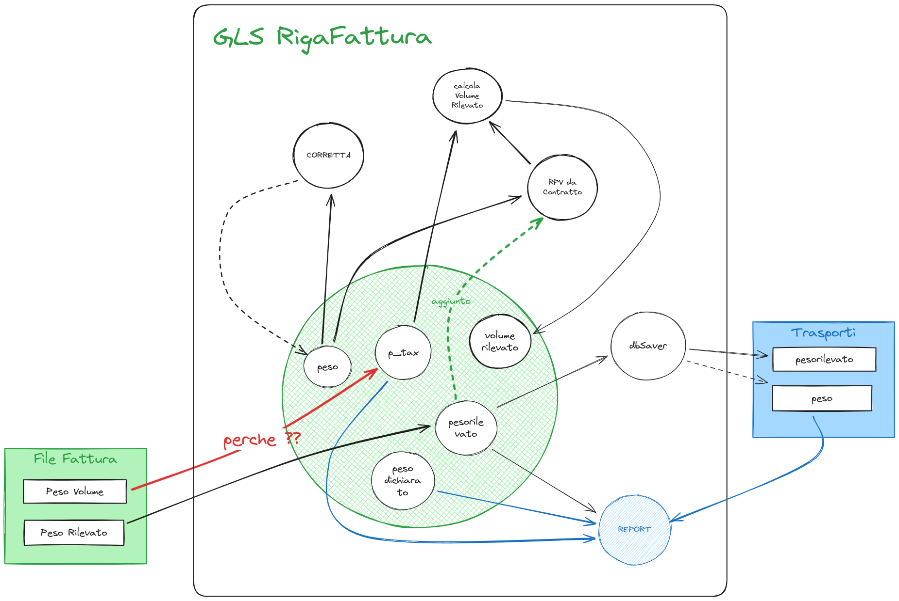
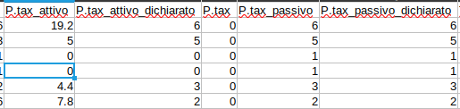
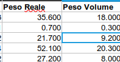
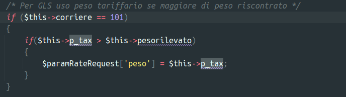

# Stand-Up Topics
	- topic 1
	- topic 1
	- oggi devo fare una attivitá su argomento [[stc test]] #topic/UX2
	-
- # Attivitá
  collapsed:: true
  {{renderer :smartblock, resume-task, Resume Task ⏩️, false}} {{renderer :smartblock, new-task, New Task ➕, false}}
	- ### Riprendo Task analizzo richieste PR san marino ⏩️
	  {{embed ((655db840-b7d8-4ed4-9c6d-2d0d948d816b)) }}
	- ### NOW Problema svincolo giacenze #client/stc 
	  tags:: #topic/giacenza, #courier/BRT, #courier/TNT
	  :LOGBOOK:
	  CLOCK: [2023-12-14 Thu 14:41:05]
	  :END:
		- https://gsped.atlassian.net/browse/AT-34632 capire se posso aiutare #courier/TNT #client/stc
		  :LOGBOOK:
		  CLOCK: [2023-12-13 Wed 10:11:17]--[2023-12-13 Wed 10:11:18] =>  00:00:01
		  CLOCK: [2023-12-13 Wed 10:11:20]--[2023-12-14 Thu 14:41:00] =>  28:29:40
		  :END:
		- vedere commento di #people/urso https://gsped.slack.com/archives/D0519JJLB6J/p1702481527919209
		- Riferimenti delle giacenze STC che danno errore:
			- tnt -> WS54720494 errore invio disposizioni di ieri
			- brt -> 166069230791
	- ### Riprendo Task problema unifarco fercam ⏩️
	  {{embed ((65771536-e4a9-41a8-890b-29159b01c847)) }} {{embed ((65771537-762c-492c-931f-630007bdc82d)) }}
	- ### NOW Richiesta aiuto #people/fabio-alessio #client/Stampasi #courier/GLS 
	  tags:: #[[Progetti/Motore di Fatturazione]], #issue/bug, #issue/design
	  :LOGBOOK:
	  CLOCK: [2023-12-13 Wed 17:19:13]
	  :END:
		- Intanto #people/fabio-alessio ha rifatto una mappatura temporanea in attesa della fix: 16343 svolta con mappatura "Peso_Volume": "p_tax", calcolo del nolo corretto problema sul report in quanto la colonna p_tax riporta il peso_Volumetrico e non il peso tassato utilizzato da GLS per il calcolo #[[topic/peso tassato]]
			- LATER bisogna riportare sul file degli opener la modifica
			  :LOGBOOK:
			  CLOCK: [2023-12-13 Wed 17:19:03]
			  :END:
		- #model/fatturazione/GlsRigaFattura usa `p_tax` per memorizzare il peso volumetrico ( ovvero $$p_{tax} = volume * rpv$$) quando questo dovrebbe rappresentare nel programma il peso tassato, ovvero #[[topic/Massimo tra Peso e Peso Volumetrico]]
		  {:height 567, :width 857}
		- `p_tax` nel motore di fatturazione nel codice generico viene utilizzato per riportare nel report finale il #[[topic/Massimo tra Peso e Peso Volumetrico]] eventualmente presente in fattura
			- #+BEGIN_WARNING
			  non sempre viene mappato 
			  #+END_WARNING
			- DONE verificare un opener che non ha p_Tax e vedere cosa viene mostrato nel report
			  :LOGBOOK:
			  CLOCK: [2023-12-13 Wed 17:57:41]--[2023-12-13 Wed 17:57:42] =>  00:00:01
			  :END:
				- prendendo ad esempio #courier/BRT su #client/ecourier si puó vedere come per elaborazione 16233 effettivamente non essendo mappato nell'opener effettivamente sia zero nel report finale
				  
		- Nel caso specifico di #courier/GLS avviene qualcosa di diverso:
			- Per #courier/GLS alcuni opener non hanno il **Volume Rilevato** ma solo il **Peso Volume**, quindi con RPV é tecnicamente possibile ricavare il **Volume Rilevato**
			- Negli opener corrispondenti il `p_tax` viene usato per contenere quello che si chiama in fattura **Peso Volume**, questo a livello concettuale non é il peso tassato, ma bensí uno dei due termini da cui prendere il massimo.
			  
			- #+BEGIN_IMPORTANT
			  Tralasciando l'uso che ne viene fatto nei passaggi intermedi  prima della generazione del report, alla fine `p_tax` riporterá in questi casi  il **Peso Volume** - tuttavia nei casi in cui esso sia minore del **Peso Reale** quyesto non sará il risultato corretto - inoltre `p_tax` in fattura non era nemmeno presente se vogliamo essere precisi
			  #+END_IMPORTANT
		- Inoltre la #model/fatturazione/FattureRate riceve il parametro **peso** da `p_tax` se questo é maggiore del peso rilevato
		  
		- #### Azioni
			- spostare il codice della logica getRateRequest per #courier/GLS da #model/fatturazione/RigaFattura generica a #model/fatturazione/GlsRigaFattura
			- sarebbe opportuno che fosse coniato un nuovo campo DX da mettere in mappatura detto `peso_volumetrico` e questo dovrebbe essere usato al posto di `p_tax` per determinare p_tax da passarsi alla #model/fatturazione/FattureRate
				- in questo modo `p_tax` nel report sarebbe zero e il calcolo della rate continuerebbe
			- NOW creare una card jira per il problema riportando queste informazioni #action/task/new [[2023-12-14 Thursday]]
			  :LOGBOOK:
			  CLOCK: [2023-12-13 Wed 18:31:45]
			  :END:
- # Aiuto compilazione
  Se hai bisogno di aiuto nelle compilazioni ecco alcuni riferimenti utili, questi blocchi sono inclusi con embed per evitare duplicazioni
	- {{embed ((6565c304-9cba-4238-91e6-36a5a4b45930))}}
	- {{embed ((6565c304-72f1-40e2-b2ac-a2eab69b4998))}}
	- {{embed ((6565c304-fbc2-4931-ab16-96384d8543be))}}