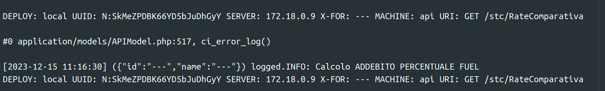

- Stand-Up Topics
	- topic 1
	- topic 3
- # Attivitá
  {{renderer :smartblock, resume-task, Resume Task ⏩️, false}} {{renderer :smartblock, new-task, New Task ➕, false}}
	- ### Riscontro su navigazione log
	  tags:: #topic/logs/analisi, #issue/time-waste, #action/discuss, #topic/meeting-argument
		- Non so perché i log api sono divisi su piú righe
		- i livelli sono appiattiti senza differenziazione
		- i livelli sono messi totalmente a casaccio
		- essendoci dicamo molte informazioni inutili direi che metterci pure magari un numero di riga e il file non guasta a sto punto ....
		  
	- ### Riprendo Task Continuo stc priscilla ⏩️
	  tags:: #resume-task 
	  {{embed ((656ed40b-6b5f-406f-86e7-04cbc3ad72ff)) }}
- # Aiuto compilazione
  Se hai bisogno di aiuto nelle compilazioni ecco alcuni riferimenti utili, questi blocchi sono inclusi con embed per evitare duplicazioni
	- {{embed ((6565c304-9cba-4238-91e6-36a5a4b45930))}}
	- {{embed ((6565c304-72f1-40e2-b2ac-a2eab69b4998))}}
	- {{embed ((6565c304-fbc2-4931-ab16-96384d8543be))}}