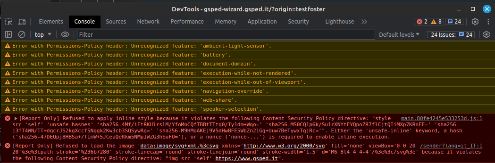

# Attivitá
id:: 5e5a0a3b-6abc-4c7b-b63c-c3fc511d322a
{{renderer :smartblock, resume-task, Resume Task ⏩️, false}} {{renderer :smartblock, new-task, New Task ➕, false}}
	- ### Riprendo Task unifarco ⏩️
	  tags:: #event/task/resume 
	  {{embed ((65818611-c7a6-483b-8af3-9371785e0234)) }}
	- ### Discussione nuovo ambiente con #people/alessio-bracco e #people/ballerini 
	  tags:: #meeting, #topic/devops, #troubleshooting/solution, #devenv
		- immagine docker gsped/php non era stata pushata e non trovata swoole come estensione
			- suggerito di fare il comando `docker image rm -f gsped/php:swoole` per cancellare vecchia copia
		- necessario cambiare nel file `PS_UPS_CONTEXT` per chi non lo avesse fatto
	- ### Supervisione applicazione policy #Instrument/CSP anche al #Progetti/Wizard 
	  id:: 18e2eb57-2a06-40a9-8ace-7e54cec2070c
	  tags:: event/task/begin, #Progetti/Wizard, #Process/Collaboration, #action/oversee
		- DONE sto dando supporto via slack, vedere gsped bluecube
		  id:: df232e1d-a6fe-4c72-a01f-46872aaa4805
		  :LOGBOOK:
		  CLOCK: [2023-12-20 Wed 08:37:51]--[2023-12-20 Wed 08:37:52] =>  00:00:01
		  CLOCK: [2023-12-20 Wed 08:37:53]--[2024-01-04 Thu 20:31:56] =>  371:54:03
		  :END:
		- [[2024-01-05 Friday]] ho inviato questo screen a della mea
		  
			- url testato https://gsped-wizard.gsped.it/?origin=testfoster
- # Stand-Up Topics
	- Segnalare che é andata online la #PR ((655db840-b7d8-4ed4-9c6d-2d0d948d816b))
	- Segnalare problema del bug su calcolaTariffe che affliggeva i calcoli della rate comparativa
	  tags:: #issue/failure, #issue/code/refactoring, #action/discuss, #issue/testing, #issue/code/repulisti
	  id:: 658f04c5-8312-4f63-869d-4d2504638625
		- ho scritto anche a #people/alessio-bracco e #people/ballerini vedi https://gsped.slack.com/archives/C0521UF8MFT/p1702973014049849
	-
- # Aiuto compilazione
  collapsed:: true
  Se hai bisogno di aiuto nelle compilazioni ecco alcuni riferimenti utili, questi blocchi sono inclusi con embed per evitare duplicazioni
	- {{embed ((6565c304-9cba-4238-91e6-36a5a4b45930))}}
	- {{embed ((6565c304-72f1-40e2-b2ac-a2eab69b4998))}}
	- {{embed ((6565c304-fbc2-4931-ab16-96384d8543be))}}