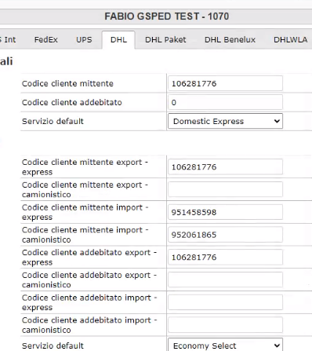
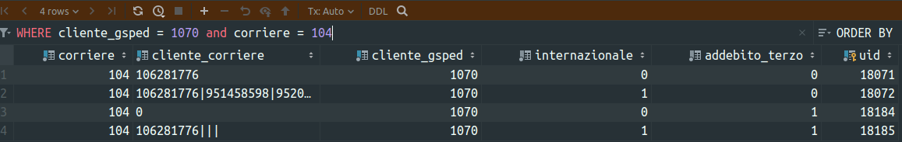

# Stand-Up Topics
	- chiedere a fabio per api/application/controllers/RateComparativa.php:442 ? che succede se non trovo nulla? che rispondo ? ieri UPS dava un errore monetary value
		- chiaramente questo é un problema perché potremmo non dare risposte valide
		- NOW chiedere a #people/valerio se per lui va bene rispondere con un fallback ovvero analisi per addebiti #action/ask-question
		  :LOGBOOK:
		  CLOCK: [2023-12-20 Wed 15:26:15]
		  :END:
	- chiedere a bracco di rivedere la pr perche per via del merge é complesso, in ogni caso attendere per il merge fare solo la revisione
- # Attivitá
  {{renderer :smartblock, resume-task, Resume Task ⏩️, false}} {{renderer :smartblock, new-task, New Task ➕, false}}
	- ### NOW Revisionare la PR mailchimp di ricci
	  tags:: event/task/begin, #people/ricci, #Instrument/mailchimp, #PR/review, #action/review
	  :LOGBOOK:
	  CLOCK: [2023-12-20 Wed 16:30:41]
	  :END:
		- Repository da revisionare
			- [Produzione](https://github.com/omnilogsc/Gsped-produzione/pull/2671)
			- [API](https://github.com/omnilogsc/Gsped-api-cd/pull/1157)
			- [Commons](https://github.com/omnilogsc/Gsped-commons/pull/5)
			- [Shared](https://github.com/omnilogsc/Gsped-shared/pull/96)
	- ### NOW Fare revisione PR 307
	  id:: 6583e916-adeb-4864-8169-79bf0df31ff7
	  tags:: #event/task/begin, #topic/courier-logic, #topic/caching
	  :LOGBOOK:
	  CLOCK: [2023-12-20 Wed 16:32:19]
	  :END:
		- cercavo qualche ottimizzazione
		- aggiunta fix per fallback in caso di mancata risposta
		- DONE verificare anche la cache di getTempiTransito
		- chiedere per ups a ricci se ci sono aggiornamenti nuovo formato
		- [[2023-12-27 Wednesday]]
			- chiedere per ups jhonny per altre informazioni, trascrivere quanto recepito
			- DONE risolto il problema del monetary value, era un problema di codifica del json
			- #### Problemi ancora presenti
				- DONE miglioramento caching delle chiamate rate
					- Per #courier/DHL il `servizio` viene passato alla rate e in base a opzioni import / export puó essere usato un diverso account nella richiesta
					  :LOGBOOK:
					  CLOCK: [2023-12-28 Thu 15:37:49]--[2023-12-28 Thu 15:37:49] =>  00:00:00
					  :END:
					- questo determina il fatto che la stessa chiamata a corriere con un certo clientId non puó andare in cache con chiave `corriere:client_id` fissa ma bisogna necessariamente usare altri dati per andare in cache come il servizio
					- utilizzata una chiave per la #topic/cache
					- In generale la rate viene invocata indicando un clientId e la risposta per la stessa spedizione puó andare in cache per un certo tempo, tuttavia in alcuni casi la risposta puó differire al variare di ulteriori parametri come il #topic/servizio
						- chiedere parere a #people/fabio-alessio, #action/question
		- [[2023-12-28 Thursday]]
			- LATER come si chiama la vista che mostra la #model/fatturazione/RateComparativa ? per poter stabilire dei defaults sensati per la funzione `doRate` é necessario capire se la view che mostra i risultati della #model/fatturazione/RateComparativa ne tenga in qualche modo conto 
			  tags:: #Instrument/MVC/View, #doc/design, #doc/code, #model/fatturazione/RateComparativa
				- La view é `legacy/application/views/gsped20/crea_spedizione.php`
				- il file #Instrument/Javascript che implementa la logica é `js/gsped20/crea_spedizione.js`
				- la funzione `rateComparativaElaboraArray` formatta output
					- `rateComparativaRisultati` formatta il risultato fornito dalla precedente
						- al suo interno usa `buildTableFromArray` che tuttavia é abbastanza complicata da capire #issue/code/convolution
					- il #topic/tempo-transito viene considerato solo se `boolean true`
					- `varie_dettaglio` viene consideraro se array non vuoto
					- non sembra esserci alcuna logica che deter
			- Il codice per determinare i #topic/tempo-transito usato #model/fatturazione/RateComparativa é #topic/courier-logic
			- il caching delle chiamate rate é potenzialmente oggetto della #topic/courier-logic
			- LATER chiede #courier/glovo chi lo usa #action/ask-question
			- LATER formato dei codici contratto #courier/DHL non é documentato , documentare ! #action/doc
			  tags:: #topic/courier-logic, #issue/information/missing, #model/core/codici_cliente, #issue/doc/missing, #topic/GUI, #[[Progetti/Gsped Legacy]]
			  collapsed:: true
				- 
				- {:height 99, :width 574}
				- ```php
				  // DHL export/import
				  if (isset($_POST['id_corriere_internazionale_104'])) {
				    $_POST['id_corriere_internazionale_104'] =
				      $_POST['id_corriere_internazionale_104'] . '|' .
				      $_POST['id_corriere_internazionale_104_import'] . '|' .
				      $_POST['id_corriere_internazionale_104_import_economy'] . '|' .
				      $_POST['id_corriere_internazionale_104_export_economy'];
				    $_POST['id_corriere_addebito_internazionale_104'] =
				      $_POST['id_corriere_addebito_internazionale_104'] . '|' .
				      $_POST['id_corriere_addebito_internazionale_104_import'] . '|' .
				      $_POST['id_corriere_addebito_internazionale_104_import_economy'] . '|' .
				      $_POST['id_corriere_addebito_internazionale_104_export_economy'];
				  
				    unset($_POST['id_corriere_internazionale_104_import']);
				    unset($_POST['id_corriere_internazionale_104_import_economy']);
				    unset($_POST['id_corriere_internazionale_104_export_economy']);
				    unset($_POST['id_corriere_addebito_internazionale_104_import']);
				    unset($_POST['id_corriere_addebito_internazionale_104_import_economy']);
				    unset($_POST['id_corriere_addebito_internazionale_104_export_economy']);
				  }
				  ```
				- #model/core/codici_cliente `addebito_terzo`
	- ### NOW Support #people/priscilla
	  tags:: #client/Bonzai, #courier/BRT
	  :LOGBOOK:
	  CLOCK: [2023-12-20 Wed 16:24:48]
	  :END:
		- elaborazione 16335 non calcola il peso tassato corretto, solito problema legato a [AN-66|FattureRate: calcolo tariffario | p_tax/peso tassato del nolo viene sovrascritto dal p_tax/peso tassato degli accessori se essi calcolati in sequenza 👹](https://gsped.atlassian.net/browse/AN-66) .
		- ho collegato anche questa issue [FT-146|Bonzai | BRT: Il calcolo del peso tassato é errato perché sovrascritto dagli accessori](https://gsped.atlassian.net/browse/FT-146)
		- attendere che #people/priscilla faccia altre annotazioni di problemi
		- [[2023-12-21 Thursday]] ha fatto altre annotazione su https://gsped.atlassian.net/browse/FT-146
- # Aiuto compilazione
  collapsed:: true
  Se hai bisogno di aiuto nelle compilazioni ecco alcuni riferimenti utili, questi blocchi sono inclusi con embed per evitare duplicazioni
	- {{embed ((6565c304-9cba-4238-91e6-36a5a4b45930))}}
	- {{embed ((6565c304-72f1-40e2-b2ac-a2eab69b4998))}}
	- {{embed ((6565c304-fbc2-4931-ab16-96384d8543be))}}