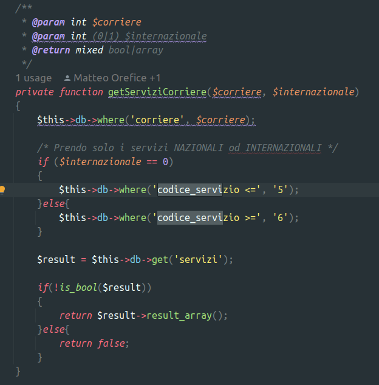

# Stand-Up Topics
	- vedi eventuali note in **Linked Reference**
	- ### Domande per #people/fabio-alessio del cazzo
	  id:: 658edf39-ee8c-41b4-84ba-8760d6d7156b
		- 
			- ma se esiste flag_internazionale per quale cavolo di motivo viene usato sto maggiore uguale ????
		- Come mai Import / tutti la logica prevede che in un if ritornino stringa vuota e altri un default ?
			- {{renderer code_diagram,plantuml}}
				- ```plantuml
				  @startuml
				  'skinparam ConditionEndStyle hline
				  !pragma useVerticalIf on
				  !theme aws-orange
				  start
				  if (import) then (yes)
				     if (srv richiesto
				  é Economy Select?) then (yes)
				        if (ha import
				  camionistico?) then (yes)
				         :economy-import-3;
				       else
				         #red:NULL;
				       endif
				      else
				        if (ha import
				  express?) then (yes)
				          :express-import-2;
				        else
				          #red:NULL;
				        endif
				      endif
				  elseif (export) then (yes)
				   if(srv richiesto
				  ê Economy Select?) then
				    if(ha Economy) then
				      :code-economy-export-4;
				    else
				     :code-express-export-1;
				    endif
				   else
				    if(ha Economy) then
				      :code-express-export-1;
				     else
				       #red:NULL;
				     endif
				   endif
				  else
				   :nazionale;
				  endif
				  stop
				  @enduml
				  ```
- # Attivitá
  {{renderer :smartblock, resume-task, Resume Task ⏩️, false}} {{renderer :smartblock, new-task, New Task ➕, false}}
- # Aiuto compilazione
  collapsed:: true
  Se hai bisogno di aiuto nelle compilazioni ecco alcuni riferimenti utili, questi blocchi sono inclusi con embed per evitare duplicazioni
	- {{embed ((6565c304-9cba-4238-91e6-36a5a4b45930))}}
	- {{embed ((6565c304-72f1-40e2-b2ac-a2eab69b4998))}}
	- {{embed ((6565c304-fbc2-4931-ab16-96384d8543be))}}