# Stand-Up Topics
	- vedi eventuali note in **Linked Reference**
	- ## Domande
		- ### Per #people/valerio
		  collapsed:: true
			- #### PR 307
				- #+BEGIN_WARNING
				  problema del reseller in expimp ? rimandiamo all'analisi ?
				  #+END_WARNING
					- ok prendiamo preventivamente la versione in legacy per la PR 22-307 #event/answer
				- #people/fabio-alessio mi ha fatto notare il problema delle tabellecomuni che a tendere potrebbero essere un problema, ho anche alimentato con le stesse perplessitá il task neocreato in analisi https://gsped.atlassian.net/browse/PS22-434
				  id:: 6597b47b-6a03-4a17-a1a6-f51ad42467b1
					- a tendere saranno una tabella separata, si potrebbe mettere un punto e a capo con una corretta analisi
					- LATER creare un task di analisi #action/task/new per analizzare in gruppo problema delle tabelle comuni
					  :LOGBOOK:
					  CLOCK: [2024-01-04 Thu 12:53:11]
					  :END:
						- DONE crea un documento in #media/confluence  https://gsped.atlassian.net/wiki/spaces/Sviluppi/pages/edit-v2/1121550358
				- Per costi accessori da rate corriere come risolviamo il problema della sorgente degli addebiti da #models/gsped/fatturazione/costi_accessori_master oppure da #models/gsped/fatturazione/fatture_corrieri_tipiaddvari ? ora il mio codice é parametrico 
				  tags:: #issue/decision, #action/question
			- Riprendo la domanda posta a #people/fabio-alessio e la pongo
			  ((658f04c5-fdef-419a-9d91-f0475269cdb8))
				- bisogna usare il flag !!!! si ma non sappiamo se sia coerente con questa logica
				- candidato
- # Attivitá
  {{renderer :smartblock, resume-task, Resume Task ⏩️, false}} {{renderer :smartblock, new-task, New Task ➕, false}}
	- ### NOW Priscilla richiede mappatura #client/blumen #courier/PDB
	  id:: 6597b47b-c7f1-45a9-9fb1-37cfb0c18512
	  tags:: event/task/begin, #topic/daily-journal-task, #doc/howtos, #action/doc, #action/share
	  collapsed:: true
	  :LOGBOOK:
	  CLOCK: [2024-01-04 Thu 20:25:04]
	  :END:
		- Ho dovuto copiare da ubik e togliere una colonna
		- ho aggiornato il file master
		- tuttavia sussiste un problema ancora sul case degli addebiti, alla fine parlando con #people/valerio e #people/fabio-alessio abbiamo deciso di fare una correzione portando all'uppercase quelli di blumen e PDB va fatto anche su ubik mi sa....
			- altri corrieri afflitti dalla presenza di codici lowercase #topic/lowercase
			  
		- bisogna creare i vari task in jira ed allacciarsi alla issue originale
			- https://github.com/omnilogsc/Gsped-fatturazione/pull/36
			- https://gsped.atlassian.net/browse/FT-139 segnalato da Diego
			- issue generale #jira/i/FT-123 aperta anche per segnare la doc
		- attenzione al campo #topic/p_tax che non sembra essere utile a nulla, verificare che prenda quello corretto per i conteggi
		  vedere la pagina
		  {{embed ((658f04c5-6465-4755-bebe-337f9294bf27))}}
		- [[2024-01-05 Friday]]
			- ho fatto la update su aurora con la seguente query [update_pdb_aurora.sql](../assets/update_pdb_aurora_1704446937892_0.sql) qui il backup [update_pdb_backup.sql](../assets/update_pdb_backup_1704446968285_0.sql)
				- richiesto rilancio a priscilla
			- DONE ricordarsi di aggiornare JIRA
			  :LOGBOOK:
			  CLOCK: [2024-01-05 Fri 10:51:39]--[2024-01-05 Fri 18:21:11] =>  07:29:32
			  :END:
				- creata card
			- dopo correzione sul db ci sono errori sul peso delle spedizioni in migliaia
			  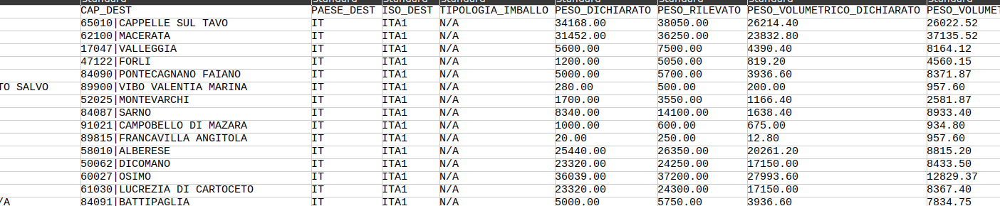{:height 156, :width 714}
			- dobbiamo scrivere al corriere, come si recupera il contatto?
				- ho scritto io al contatto Luca Rolli
		- [[2024-01-08 Monday]]
			- ho scritto a Rolli e al cliente  purtroppo hanno risposto con due mappature diverse che secondo loro sono corrette... quindi di fronte a questo problema come approcciamo ?
				- a mio parere conviene associare alle configurazioni centralizzate dei client id , anche solo su una colonna json mysql
				- la versione mysql é la 5.7
				-
		- query-table:: true
		  collapsed:: true
		  #+BEGIN_QUERY
		  {:title "Task reference table ↗️ Click 🖱️to expand..." :query [:find (pull ?h [*])
		      :in $ ?parent
		      :where
		      [?parent :block/parent ?grandparent]
		      [?h :block/refs ?parent]
		  ]
		  :inputs [:parent-block]
		  :collapsed? true}
		  #+END_QUERY
	- ### NOW Inizio integrazione provider pagamento Ingenico
	  id:: 6597b47b-f850-4106-bb70-ec01764db5fe
	  SCHEDULED: <2024-01-31 Wed>
	  tags:: event/task/begin, #topic/daily-journal-task, #jira/i/PS22-412, #Instrument/Ingenico
	  id:: 6597b47b-f850-4106-bb70-ec01764db5fe
	  :LOGBOOK:
	  CLOCK: [2024-01-10 Wed 16:26:44]
	  :END:
		- Mando mail a #people/valerio con domande da porre
		- [[2024-01-10 Wednesday]]
		  collapsed:: true
			- NOW porre domanda su https://docs.connect.worldline-solutions.com/getting-started/operating-models/ quale adotteranno ?
			  :LOGBOOK:
			  CLOCK: [2024-01-11 Thu 22:21:36]
			  :END:
		- ### questioni aperte ⚠️
		  collapsed:: true
		  :LOGBOOK:
		  CLOCK: [2024-02-16 Fri 15:12:58]--[2024-02-16 Fri 15:13:04] =>  00:00:06
		  :END:
			- La transazione va in errore solo grazie a condizione che compromettono esito, impossibilità di leggere stato non compromette perché può essere ritentato
			- Errore di transazione va esposto con status != 200, ora non lo fa... Viene trattato? Ora ingenico.status error non mi sembra dare errore
			- Last error è error usabile per migliorare output a client per motivi fallimento e va scritto solo nelle transazioni e rappresenta gli errori per ultimo failure cambiare nome
			- Le eccezioni devono marcare status diversi da 200 ma non necessariamente marcare un errore sulla transazione a meno che siano errori come al punto 1, si poterbbe aggiungere un flag trigger_error_status
			- lo stato della transazione va messo in errore solo alla fine della pipeline e prima del format
			- verificare che il cambio di id pagamento abbia senso per la stessa transazione
			- vedere se statusInfo puó essere usato nel set transaction error finale
			- nel webhook quando ha senso marcare la transazione in errore ? per quali tipi di eccezione ? potrebbero esserci casi dove non ha senso ? in teoria nel display se arriviamo con stato non decente allora possiamo andare in errore
			- provare a risolvere error segnalati dal webhook nella display ( statustransition )
			- aggiungere log estensivo con ci_error_log ma su quali livelli ?
		- [[2024-01-11 Thursday]]
			- Ho implementato una configurazione per tunneling via #Instrument/ngrok e #Instrument/zrok
				- Vedere il ramo https://github.com/MatteoOreficeGS/mirror-gsped-docker
				- Tutto é versionato su quel ramo compresa la guida
				- ho contattato anche il team di zrok https://openziti.discourse.group/t/rewriting-response-body-in-caddy-backend-mode/1971/5
				- 
		- [[2024-01-12 Friday]]
			- oggi devo fare l'hello world
			- ho fatto il test vedere il gist https://gist.github.com/MatteoOreficeGS/bd61ba7c7827cdeca975ff52fd494a16
		- [[2024-01-15 Monday]]
			- leggendo la doc https://apireference.connect.worldline-solutions.com/s2sapi/v1/en_US/java/hostedcheckouts/create.html?paymentPlatform=ALL ho visto che al dominio se viene messi in cima il sotto dominio `payment.` prima di url ritornato si visualizza la pagina
			  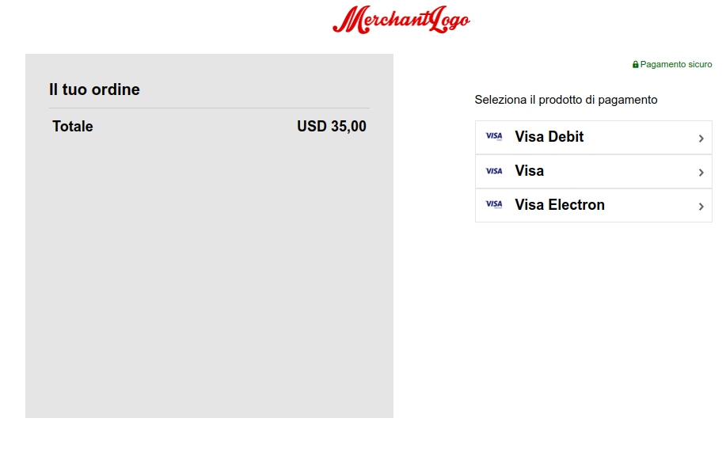
			- > notare come l'endpoint di sandbox poi non centri con la formazione dell'url di redirect https://payment.pay1.sandbox.secured-by-ingenico.com/checkout/1221-a68e7e10b9af4b61b8e416879640abfb:065a4f9c-b807-71ff-98fc-8b51cec56d62:3484ba2fd6b34091859cc82a432e0aca
			- 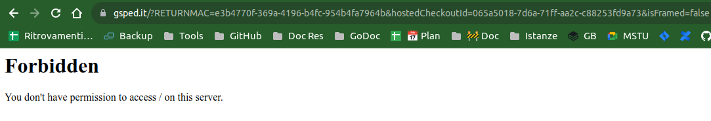
		- [[2024-01-17 Wednesday]]
			- parlato con david per capire se aveva informazioni su returndhl client
			- parlato con della mea vedere https://gsped-bluecube.slack.com/archives/C03HDPH7DSR/p1705486672213149
		- [[2024-01-22 Monday]]
			- Continuo analisi
				- aggiunta sezione /processors a uml sequence
				- chiedo a Della Mea conferma su trattamento dei parametri in  /display
				- arrichisce task 1 [PS22-472|Analisi codice paypment processors monetaweb](https://gsped.atlassian.net/browse/PS22-472)
		- [[2024-01-26 Friday]]
		  collapsed:: true
			- LATER Documentare il flag #models/gsped/shipment/creazione_postuma
			- Finalmente deone ha risposto inoltrando al supporto del merchant
		- [[2024-01-29 Monday]]
			- compilazione app angular in locale
			- vedi folder /home/orefice/src/gsped/wizard
		- [[2024-01-30 Tuesday]]
		  collapsed:: true
			- 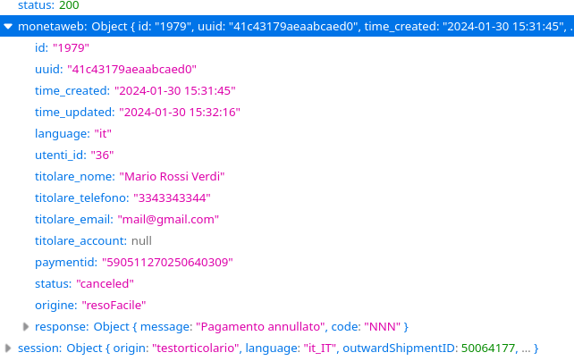
				- gli stati di fallimento sono failed e canceled
				- ho segnalato a Lorenzo della Mea di verificare anche il 200 esterno
		- [[2024-01-31 Wednesday]]
			- Faccio un po' di pulizia nel codice
			- Creata issue per analizzare flusso pagamento separato [PS22-511|Analisi per flusso pagamenti separati](https://gsped.atlassian.net/browse/PS22-511)
		- [[2024-02-02 Friday]]
		  collapsed:: true
			- iniziata guida per il cliente per la configurazione https://gsped.atlassian.net/wiki/spaces/Sviluppi/pages/1145700353/Configuration+HowTo
		- [[2024-02-06 Tuesday]]
			- sviluppata integrazione del webhook
		- [[2024-02-07 Wednesday]]
		  collapsed:: true
			- scoperta lentezza della ldv_immediata, sembra un deadlock su tabella trasporti
				- https://gsped.slack.com/archives/D051JLRCJS0/p1707335321001289 vedi slack
				- 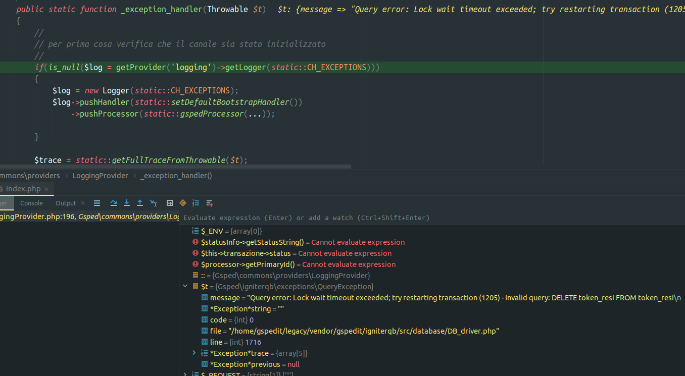
				- 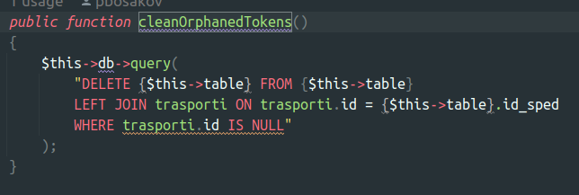
		- [[2024-02-08 Thursday]]
			- DONE aggiungere note documento su disponibilitá
			- Creato documento drive per guida setup ingenico DHL spain
			- Creata pagina contenitore per documentazione gitbook https://app.gitbook.com/o/-LhpbdRCZplUyqAg775u/s/-Mi_rXbXjBv4cNL-NNCE/~/changes/394/pagamenti/ingenico-connect
			- Create PR https://github.com/omnilogsc/Gsped-api-cd/pull/1204
			- Inviata mail a Jose con il documento
		- [[2024-02-09 Friday]]
			- NOW verificare se Token Guardian va modificato
			  :LOGBOOK:
			  CLOCK: [2024-02-09 Fri 10:36:14]
			  :END:
		- [[2024-02-13 Tuesday]]
			- Gestione messaggi errore pagamento
				- 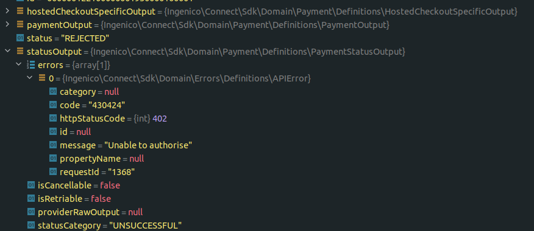
		- [[2024-02-15 Thursday]]
			- aggiunto switch per disattivare ldv immediata per flusso doppio pagamento
				- inseriti num sped in fattura su shopping cart item
			- parametrizzazione della configurazione via cfg
			- I webhook arrivano con una firma diversa  eec6059a-9acf-46ba-a4c8-6cfbdb69e8c3
			  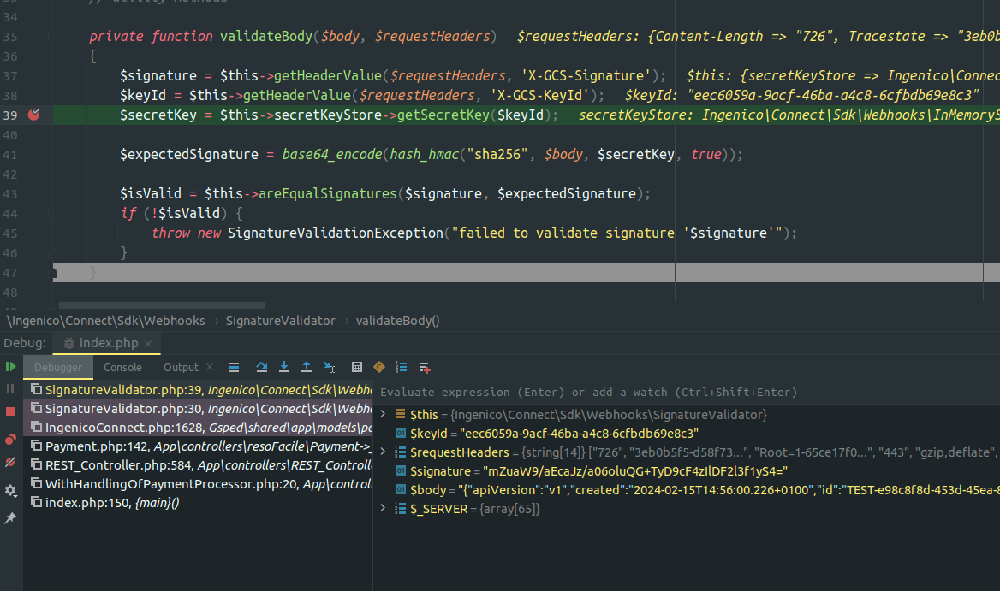
		- [[2024-02-16 Friday]]
			- Discussione con #people/ballerini e #people/alessio-bracco su uso improprio del deploy
				- su testbed ENVIRONMENT é production e non development, quindi lo switch per i test lo devo fare grazie al db cfg #issue/design, #issue/config, quali sono i modi corretti di impostare una condizione di test oggi ? #issue/deploy #issue/testing
				- non poso fare un test su ENVIRONMENT uso una cfg
				- segnalato anche a #people/valerio
		- [[2024-02-19 Monday]]
			- Fatta call con Jose per la configurazione della console, purtroppo i test sono USD / US e non EUR / ES
			- A parte quello il flusso attuale funziona con PayPal
		- [[2024-02-20 Tuesday]]
			- Osservazioni su test condizioni di errore
				- Se status == 200 e alias.status == error ???
				- Se status == 200 e alias.failed == ???
				- Se status == 200 e alias.failed == ???
		- [[2024-02-27 Tuesday]]
			- #### Problema `isHomePickup` non viene portato avanti
			- 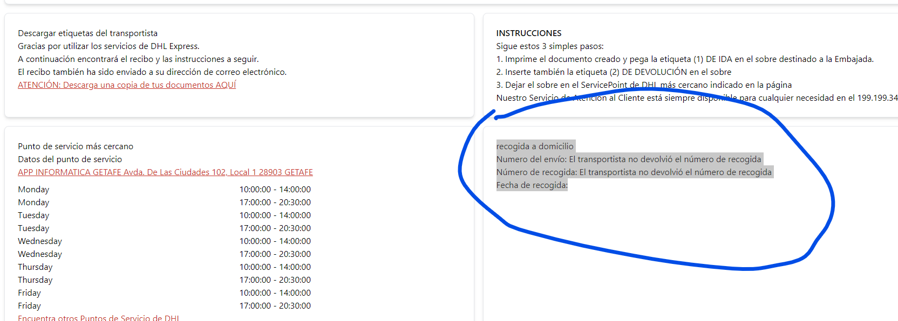
				- a prescindere visualizzare i numeri di spedizione vanno visualizzati sempre
					- 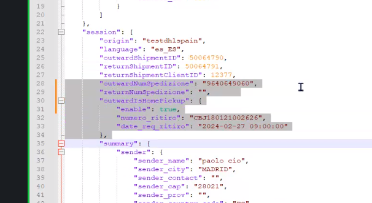
					- memorizzare x andata:
						- num spedizione
						- ed eventuali dati su ritiro
				- ✅️ abbiamo risolto il bug, non veniva portato avanti li valore is `isHomePickup` inoltre il check nella view era errato e non consentiva
			-
		- query-table:: true
		  query-sort-by:: page
		  query-sort-desc:: false
		  collapsed:: true
		  #+BEGIN_QUERY
		  {:title "Task reference table ↗️ Click 🖱️to expand..." :query [:find (pull ?h [*])
		      :in $ ?parent
		      :where
		      [?parent :block/parent ?grandparent]
		      [?h :block/refs ?parent]
		  ]
		  :inputs [:parent-block]
		  :collapsed? true}
		  #+END_QUERY
	- ### DONE Riprendo Task Continuo processo revisione 307 ⏩️
	  tags:: #event/task/resume
	  {{embed ((6583e916-adeb-4864-8169-79bf0df31ff7))}}
	- ### DONE Investigazione performance ecourier fatturazione
	  id:: 8cb5ef65-49c9-481e-82e6-1bf31372ae5b
	  tags:: event/task/begin, #topic/daily-journal-task, #topic/hard-limit, #topic/soft-limit, #troubleshooting/solution, #topic/connections, #issue/network, #issue/performance
	  collapsed:: true
	  :LOGBOOK:
	  CLOCK: [2024-01-04 Thu 12:37:30]--[2024-01-04 Thu 12:37:37] =>  00:00:07
	  :END:
		- Scovati 12 task in esecuzione durante il job di fatturazione su #client/ecourier, il limite sta in `application/config/Config.php`
		  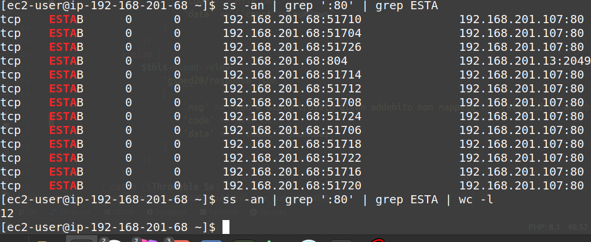
			- abbiamo fatto alcune indagini e a mio parere potrebbe essere anche un problema di autoscaling non reattivo, é gia successo il passato, siamo sicuro che 12 thread siano sufficienti per far scalare il gruppo?
			- il gruppo scala in funzione di cosa? perché se il problema fosse il db a quel punto il numero di child process FPM potrebbe non accettare piu connessioni o quanto meno non smaltirle senza di fatto fare il trigger per scalare
		- Aggiungo domanda per [[2024-01-05 Friday]] riguardo a numero 12 in pthread e ottimizzazione sui retries che potrebbe allungare di parecchio i tempi
		- #people/fabio-alessio ha scoperto che la tabella `trasporti_controllo_fatture_history` non ha indice, ha predisposto una alter table
			- inotre la tabella potrebbe addirittura essere assente su alcune istanze
				- Ho proposto di fare uno stupido script che analizza il database alla ricerca di differenze importanti potrebbe essere anche utile per la creazione delle nuove istanze al fine di vegliare su corretta creazione di un database di istanza banalmente come copia
				  tags:: #idea💡, #Process/Onboarding
		- query-table:: true
		  query-properties:: [:block :tags :page]
		  collapsed:: true
		  #+BEGIN_QUERY
		  {:title "Task reference table ↗️ Click 🖱️to expand..." :query [:find (pull ?h [*])
		      :in $ ?parent
		      :where
		      [?parent :block/parent ?grandparent]
		      [?h :block/refs ?parent]
		  ]
		  :inputs [:parent-block]
		  :collapsed? true}
		  #+END_QUERY
	-
	- ### DONE Suggerisco a Valerio di usare piú board nello stesso project
	  tags:: event/task/begin, #topic/daily-journal-task
		- Vedere conversazione in slack https://gsped.slack.com/archives/D051G6XQ9DY/p1704358046916309
		- in effetti ho visto che hai creato FT-5 in sviluppo citandola nel nome....
		- query-table:: true
		  collapsed:: true
		  #+BEGIN_QUERY
		  {:title "Task reference table ↗️ Click 🖱️to expand..." :query [:find (pull ?h [*])
		      :in $ ?parent
		      :where
		      [?parent :block/parent ?grandparent]
		      [?h :block/refs ?parent]
		  ]
		  :inputs [:parent-block]
		  :collapsed? true}
		  #+END_QUERY
	-
- # Aiuto compilazione
  Se hai bisogno di aiuto nelle compilazioni ecco alcuni riferimenti utili, questi blocchi sono inclusi con embed per evitare duplicazioni
	- {{embed ((6565c304-9cba-4238-91e6-36a5a4b45930))}}
	- {{embed ((6565c304-72f1-40e2-b2ac-a2eab69b4998))}}
	- {{embed ((6565c304-fbc2-4931-ab16-96384d8543be))}}