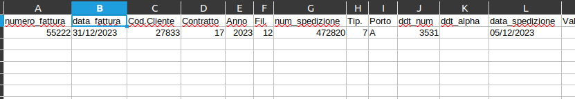

# Stand-Up Topics
	- vedi eventuali note in **Linked Reference**
	- ## per #people/valerio
		- Domande su task ((8cb5ef65-49c9-481e-82e6-1bf31372ae5b))
		  tags:: #topic/standup, #event/standup/question, #topic/standup-question, #issue/performance, #topic/scaling
			- come mai il numero biblico 12 ?
				- determinato dal numero di  cpu e da alcuni test
			- abbiamo trovato la tabella mancante history
				- questo poteva rallentare parecchio
			- abbiamo notato che  vengono fatti dei retries per le rate in caso di errore, forse avrebbe bisogno di una miglioria a seconda del tipo di errore.
			  tags:: [[Progetti/Motore di Fatturazione]], #issue/performance, #issue/error-reporting, #issue/time-waste,
- # Attivitá
  {{renderer :smartblock, resume-task, Resume Task ⏩️, false}} {{renderer :smartblock, new-task, New Task ➕, false}}
	- ### DONE Richiesta di aiuto per correzione #client/ecourier 
	  tags:: event/task/begin, #topic/daily-journal-task, #[[Progetti/Motore di Fatturazione]], #issue/code/convolution, #issue/validation, #issue/error-reporting, #courier/susa
		- Fabio mi ha chiesto questo https://gsped.slack.com/archives/D051JLRCJS0/p1704464217883669
		- sql where condizione `istanza = 'ecourier' and id in (16511,16512,16513,16514,16515,16516,16517,16519)`
		- 
		- attenzione perché **data_spedizione** viene parsato da `strtotime` e questo metodo supporta un numero limitato di formati, quindi
			- 20/12/2023 viene riconosciuto come `mm "/" dd "/" y` che vuole dire invertire mese con giorno, quindi questa data viene riconosciuta male ... 
			  ```bash
			  php -r 'echo date("Y-m-d",strtotime("20/12/2023"));'
			  >>> 1970-01-01
			  ```
		- Ho scritto a #people/fabio-marzo dando indicazione sul come risolvere
		- query-table:: true
		  collapsed:: true
		  #+BEGIN_QUERY
		  {:title "Task reference table ↗️ Click 🖱️to expand..." :query [:find (pull ?h [*])
		      :in $ ?parent
		      :where
		      [?parent :block/parent ?grandparent]
		      [?h :block/refs ?parent]
		  ]
		  :inputs [:parent-block]
		  :collapsed? true}
		  #+END_QUERY
	- DONE Domanda su forum logseq
		- a block founded by search
		  tags:: mytag
		  myprop:: myprop-value1
		- another block founded by search
		  tags:: mytag
		  myprop:: myprop-value2
	- ### LATER Condivisa scoperta del widget #jira per ticket sommersi
	  tags:: event/task/begin, #topic/daily-journal-task
		- Visionare discussione su #Instrument/slack e documentare taggando con #jira #doc/howtos, etc
		  tags:: #action/doc, #doc/howtos, #issue/sharing/knowledge, #action/share
			- vorrei poter pubblicare queste guide tramite #logseq/publish-spa
		- query-table:: true
		  collapsed:: true
		  #+BEGIN_QUERY
		  {:title "Task reference table ↗️ Click 🖱️to expand..." :query [:find (pull ?h [*])
		      :in $ ?parent
		      :where
		      [?parent :block/parent ?grandparent]
		      [?h :block/refs ?parent]
		  ]
		  :inputs [:parent-block]
		  :collapsed? true}
		  #+END_QUERY
	- ### Riprendo Task verifiche CSP wizard blucube ⏩️
	  tags:: #event/task/resume
	  {{embed ((18e2eb57-2a06-40a9-8ace-7e54cec2070c))}}
	- ### Riprendo Task Riprendo problema blumen ⏩️
	  tags:: #event/task/resume
	  {{embed ((6597b47b-c7f1-45a9-9fb1-37cfb0c18512))}}
- # Aiuto compilazione
  collapsed:: true
  Se hai bisogno di aiuto nelle compilazioni ecco alcuni riferimenti utili, questi blocchi sono inclusi con embed per evitare duplicazioni
	- {{embed ((6565c304-9cba-4238-91e6-36a5a4b45930))}}
	- {{embed ((6565c304-72f1-40e2-b2ac-a2eab69b4998))}}
	- {{embed ((6565c304-fbc2-4931-ab16-96384d8543be))}}