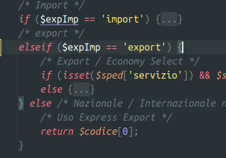

# Stand-Up Topics
	- vedi eventuali note in **Linked Reference**
	- ## per #people/valerio
		- Domande su task ((8cb5ef65-49c9-481e-82e6-1bf31372ae5b))
		  tags:: #topic/standup, #event/standup/question, #topic/standup-question, #issue/performance, #topic/scaling
			- come mai il numero biblico 12 ?
				- determinato dal numero di  cpu e da alcuni test
			- abbiamo trovato la tabella mancante history
			- abbiamo notato che  vengono fatti dei retries per le rate in caso di errore, forse avrebbe bisogno di una miglioria a seconda del tipo di errore.
	- ## per #people/fabio-alessio
		- In attuale DHLModel in effetti nazionale e internazionale coincidono .... 
		  
			- 
			- 
- # Attivitá
  {{renderer :smartblock, resume-task, Resume Task ⏩️, false}} {{renderer :smartblock, new-task, New Task ➕, false}}
- # Aiuto compilazione
  collapsed:: true
  Se hai bisogno di aiuto nelle compilazioni ecco alcuni riferimenti utili, questi blocchi sono inclusi con embed per evitare duplicazioni
	- {{embed ((6565c304-9cba-4238-91e6-36a5a4b45930))}}
	- {{embed ((6565c304-72f1-40e2-b2ac-a2eab69b4998))}}
	- {{embed ((6565c304-fbc2-4931-ab16-96384d8543be))}}