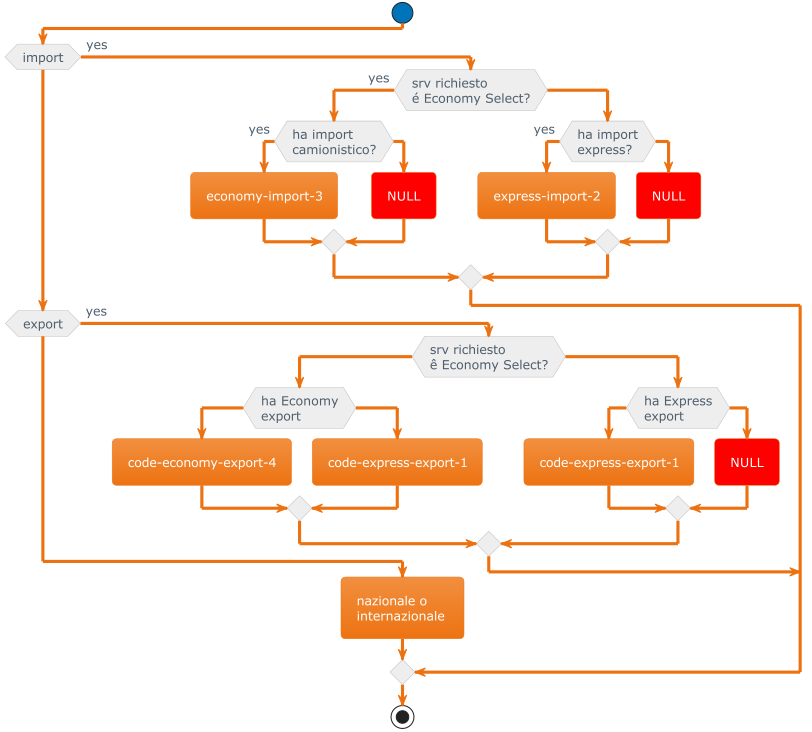
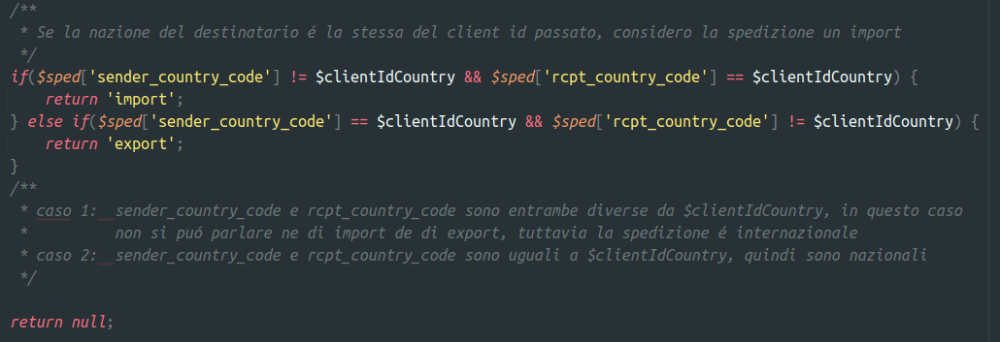

# Stand-Up Topics
	- vedi eventuali note in **Linked Reference**
	- ## per #people/fabio-alessio
		- Come smarchiamo sul lungo periodo la questione delle **tabellecomuni** ?
		  tags:: #issue/design, #issue/need-for-analysis, , #media/confluence #model/core/tabellecomuni, #issue/need-for-analysis, #analysis, #issue/decision
			- `RateComparativa` non ci sono usi di tabellecomuni
			- `FattureRateModel` non ci sono JOIN ma sulla connessione standard ci sono accessi a tabellacomuni tramite la connessione standard
			- bisogna aprire un documento per questo aspetto a lungo termine ((6597b47b-6a03-4a17-a1a6-f51ad42467b1))
				- DONE ho creato questo documento in #media/confluence https://gsped.atlassian.net/wiki/spaces/Sviluppi/pages/edit-v2/1121550358
			- Ho aggiunto risposta in PR e mi sono consultato anche con Bracco e Ballerini direi che a sto punto aggiungere implementazione non é un problema visto ch ci vanno 2 ore
		- In attuale DHLModel in effetti nazionale e internazionale coincidono .... 
		  collapsed:: true
		  
			- 
			- 
			- Ho annotato su analisi #business-rule/attribuzione-import-export il fatto che internazionale e nazionale siano collassati
- # Attivitá
  {{renderer :smartblock, resume-task, Resume Task ⏩️, false}} {{renderer :smartblock, new-task, New Task ➕, false}}
	- ### Riprendo Task Continuo #client/blumen #courier/pdb ⏩️
	  tags:: #event/task/resume
	  {{embed ((6597b47b-c7f1-45a9-9fb1-37cfb0c18512))}}
	- ### DONE Revisione per approvazione #PR #courier/PDB inviosystem
	  tags:: event/task/begin, #topic/daily-journal-task, #media/confluence , #issue/code, #issue/process, #issue/design
	  :LOGBOOK:
	  CLOCK: [2024-01-08 Mon 13:01:17]--[2024-01-08 Mon 13:01:17] =>  00:00:00
	  :END:
		- Ho integrato alcune osservazione nel documento #media/confluence che meritano di essere tracciate https://gsped.atlassian.net/wiki/spaces/~642a8bc572a895c404218f0e/pages/1119944749/Analisi+difetti+o+bad-design+del+codice+o+di+processo
		- query-table:: true
		  collapsed:: true
		  #+BEGIN_QUERY
		  {:title "Task reference table ↗️ Click 🖱️to expand..." :query [:find (pull ?h [*])
		      :in $ ?parent
		      :where
		      [?parent :block/parent ?grandparent]
		      [?h :block/refs ?parent]
		  ]
		  :inputs [:parent-block]
		  :collapsed? true}
		  #+END_QUERY
- # Aiuto compilazione
  collapsed:: true
  Se hai bisogno di aiuto nelle compilazioni ecco alcuni riferimenti utili, questi blocchi sono inclusi con embed per evitare duplicazioni
	- {{embed ((6565c304-9cba-4238-91e6-36a5a4b45930))}}
	- {{embed ((6565c304-72f1-40e2-b2ac-a2eab69b4998))}}
	- {{embed ((6565c304-fbc2-4931-ab16-96384d8543be))}}