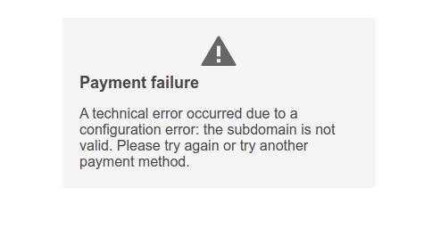
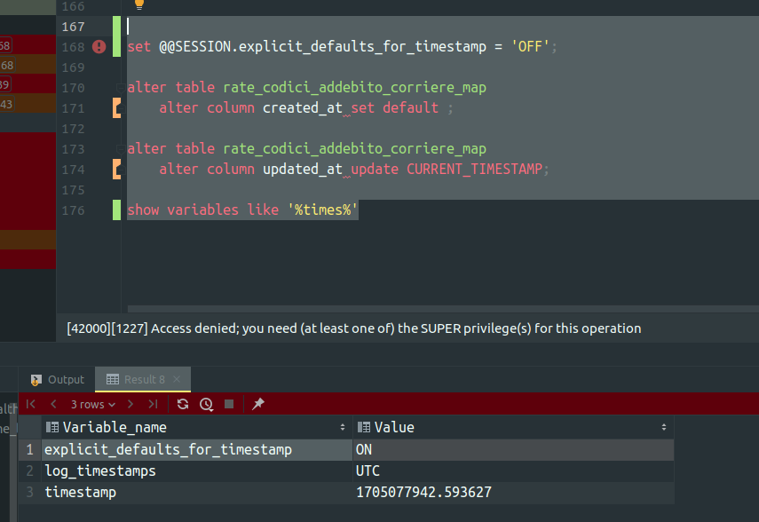

# Stand-Up Topics
	- vedi eventuali note in **Linked Reference**
	- ## Domande
		- ### Per Valerio
		  il primo step si conclude e sgancia url redirect ma poi da errore, investigo ancora
		  
		- ### Per chiunque
		  Come mai `explicit_defaults_for_timestamp` é ON ?
		  {:height 596, :width 855}
- # Attivitá
  {{renderer :smartblock, resume-task, Resume Task ⏩️, false}} {{renderer :smartblock, new-task, New Task ➕, false}}
- # Aiuto compilazione
  collapsed:: true
  Se hai bisogno di aiuto nelle compilazioni ecco alcuni riferimenti utili, questi blocchi sono inclusi con embed per evitare duplicazioni
	- {{embed ((6565c304-9cba-4238-91e6-36a5a4b45930))}}
	- {{embed ((6565c304-72f1-40e2-b2ac-a2eab69b4998))}}
	- {{embed ((6565c304-fbc2-4931-ab16-96384d8543be))}}