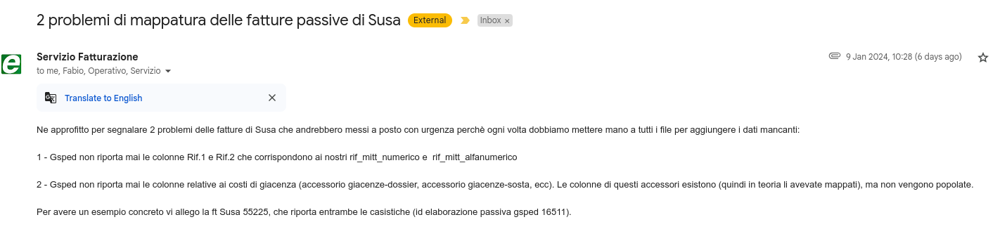

# Stand-Up Topics
	- vedi eventuali note in **Linked Reference**
	- ## Domande
	  collapsed:: true
		- ### Per Valerio
		  il primo step si conclude e sgancia url redirect ma poi da errore, investigo ancora
		  
		- ### Per chiunque
		  Come mai `explicit_defaults_for_timestamp` é ON ?
		  {:height 596, :width 855}
- # Attivitá
  {{renderer :smartblock, resume-task, Resume Task ⏩️, false}} {{renderer :smartblock, new-task, New Task ➕, false}}
	- ### NOW Problema segnalato #courier/susa #client/ecourier
	  tags:: event/task/begin, #topic/daily-journal-task
	  :LOGBOOK:
	  CLOCK: [2024-01-15 Mon 15:20:48]
	  :END:
		- 
		- Creare una card JIRA perché non esiste vedi mail di Marzo https://mail.google.com/mail/u/0/#search/from%3Afatturazione%40ecourier.it/FMfcgzGwJchvLrhZPkVmltFrkWrfFSWN
		  id:: 65aa7f01-7f84-496f-a6d7-d4e3ebcc894a
		  id:: 65aa7f01-7f84-496f-a6d7-d4e3ebcc894a
		-
		- query-table:: true
		  collapsed:: true
		  #+BEGIN_QUERY
		  {:title "Task reference table ↗️ Click 🖱️to expand..." :query [:find (pull ?h [*])
		      :in $ ?parent
		      :where
		      [?parent :block/parent ?grandparent]
		      [?h :block/refs ?parent]
		  ]
		  :inputs [:parent-block]
		  :collapsed? true}
		  #+END_QUERY
	- ### Riprendo Task Continuo implementazione ingenico ⏩️
	  tags:: #event/task/resume
	  {{embed ((6597b47b-f850-4106-bb70-ec01764db5fe))}}
- # Aiuto compilazione
  collapsed:: true
  Se hai bisogno di aiuto nelle compilazioni ecco alcuni riferimenti utili, questi blocchi sono inclusi con embed per evitare duplicazioni
	- {{embed ((6565c304-9cba-4238-91e6-36a5a4b45930))}}
	- {{embed ((6565c304-72f1-40e2-b2ac-a2eab69b4998))}}
	- {{embed ((6565c304-fbc2-4931-ab16-96384d8543be))}}