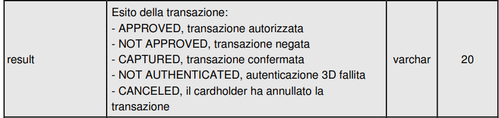

# Stand-Up Topics
	- vedi eventuali note in **Linked Reference**
	- ## Domande su ResoFacile e Moneta
		- **URGENTE**: In merito ad attuali incoerente della WebApp come comportarsi ? tirare dentro Fabio
			- Domanda per Fabio, l operazione di display é programmata con dei timeout ?
		- **BNB**:
			- Quante volte viene chiamato il webhook per esito lo sapete ?
				- 
			- Differenze tra CAPTURED e APPROVED ?
		- Wordline:
			- modo di bloccare le carte di credito corretto ?
			- testare i webhook per delay dalla risposta
		- Revisione linee guida
			- I tipi in input sono richiesti ? no, se troppo estese
				- si se sono verticali
		-
		-
		-
- # Attivitá
  {{renderer :smartblock, resume-task, Resume Task ⏩️, false}} {{renderer :smartblock, new-task, New Task ➕, false}}
- # Aiuto compilazione
  collapsed:: true
  Se hai bisogno di aiuto nelle compilazioni ecco alcuni riferimenti utili, questi blocchi sono inclusi con embed per evitare duplicazioni
	- {{embed ((6565c304-9cba-4238-91e6-36a5a4b45930))}}
	- {{embed ((6565c304-72f1-40e2-b2ac-a2eab69b4998))}}
	- {{embed ((6565c304-fbc2-4931-ab16-96384d8543be))}}