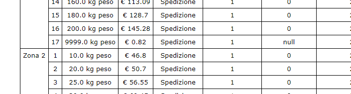
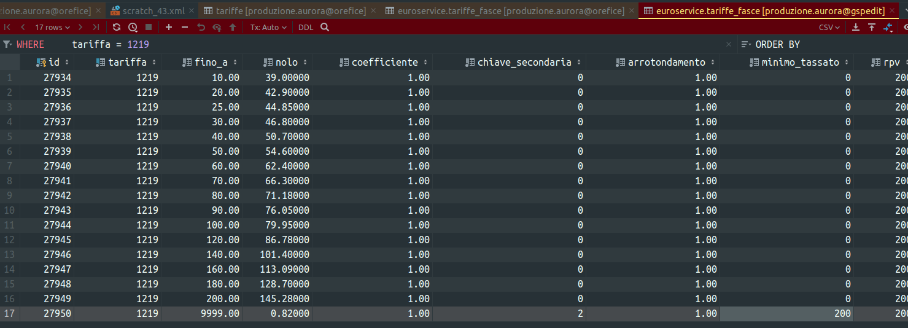

# Stand-Up Topics
	- vedi eventuali note in **Linked Reference**
- # Attivitá
  {{renderer :smartblock, resume-task, Resume Task ⏩️, false}} {{renderer :smartblock, new-task, New Task ➕, false}}
	- ### NOW Avvio attivitá analisi su sdoppiamento  / cambio numeri di spedizione
	  tags:: event/task/begin, #topic/daily-journal-task, #issue/doc/missing, #issue/feature/missing, #issue/code/convolution, #business-rule/cambio-numero-di-spedizione
	  :LOGBOOK:
	  CLOCK: [2024-02-01 Thu 11:08:46]
	  :END:
		- Scopo analizzare la regole del business legato a sostituzione del numero di spedizione
		- Creata issue JIRA https://gsped.atlassian.net/browse/PS22-514?filter=10668
		- 
		- query-table:: true
		  collapsed:: true
		  #+BEGIN_QUERY
		  {:title "Task reference table ↗️ Click 🖱️to expand..." :query [:find (pull ?h [*])
		      :in $ ?parent
		      :where
		      [?parent :block/parent ?grandparent]
		      [?h :block/refs ?parent]
		  ]
		  :inputs [:parent-block]
		  :collapsed? true}
		  #+END_QUERY
	- ### NOW Richiesta supporto #client/euroservice
	  tags:: event/task/begin, #topic/daily-journal-task
	  :LOGBOOK:
	  CLOCK: [2024-02-01 Thu 09:04:00]
	  :END:
		- Vedi slack https://gsped.slack.com/archives/D051G6YB5UJ/p1706708548490929
		- Vedere FRIGOMECCANICA DHL ECO 2024
		- 
		- [[2024-02-01 Thursday]]
			- ho sostituito a mano nel db
			  
			- Perché compare 0 ? in zona 1
	- ### Riprendo Task supporto svincolo ⏩️
	  tags:: #event/task/resume
	  {{embed ((6ac781a3-7918-44b5-894d-9f95c360d806))}}
	- ### Analisi pagamento separato ⏩️
	  tags:: #event/task/resume
	  {{embed ((6597b47b-f850-4106-bb70-ec01764db5fe))}}
- # Aiuto compilazione
  collapsed:: true
  Se hai bisogno di aiuto nelle compilazioni ecco alcuni riferimenti utili, questi blocchi sono inclusi con embed per evitare duplicazioni
	- {{embed ((6565c304-9cba-4238-91e6-36a5a4b45930))}}
	- {{embed ((6565c304-72f1-40e2-b2ac-a2eab69b4998))}}
	- {{embed ((6565c304-fbc2-4931-ab16-96384d8543be))}}