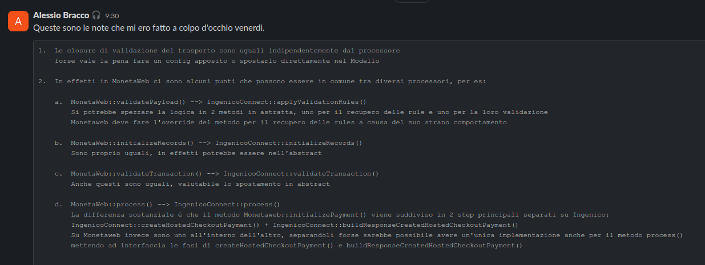

# Stand-Up Topics
	- vedi eventuali note in **Linked Reference**
	- ## Piccola discussione con Ballerini
	  collapsed:: true
		- mi state chiedendo di cambiare il nome di un metodo perché lo avrei "buttato li" un po' a caso
			- a parte che non butto il codice a caso, ho semplicemente cercato al soluzione piú rapida per non andare a incastrarmi e perdere tempo
			- notare che non essendoci un ambiente di testing vero, che non é la sandbox, ho potuto sviluppare e testare con lo stack locale usando il tunnel, se avessi dovuto fare affidamento sull infrastruttura GSped a quest ora ero ancora appeso
			- ok spiegatemi perché ho dovuto fare copia e incolla se segue un design disaccoppiato ed agile dal punto di vista oop
				- eh ma quel processore era un tentativo quindi sicuramente bisogna fare un po' di ristrutturazione
					- ( perfetto lo devo sistemare io il vostro tentativo penso io ) ma rispondo unicamente che per quello ci sará tempo dopo ora interessa pubblicare sto maledetto url che peraltro funzionava giá la settimana scorsa 😭
		- io scrivo troppo
			- questa é un affermazione che mi sembra un controsenso in gsped, forse é piu di qualcuno la voglia di non scrivere e non leggere ? perché se mi dici scrivi troppo io cosa dovrei capire?
			- chiediamo a Valerio se é un problema scrivere troppo
				- ovviamente non ti hanno aggiunto
		- io sono un junior
			- non commento questo se non che é un offesa personale come altre peraltro, tipo che il codice della RateComparativa fa schifo ( peccato che non l'ho scritto io... forse non avendolo mai esaminato sono un po' caduti dal pero , anche perché diciamo la veritá dei codici che ho visto é quello dove c'e piu logica )
		- ho dato il codice tardi
			- 
		- spostare in shared  non va bene
			-
		- osservazioni tecniche
			- 
		-
- # Attivitá
  {{renderer :smartblock, resume-task, Resume Task ⏩️, false}} {{renderer :smartblock, new-task, New Task ➕, false}}
- # Aiuto compilazione
  collapsed:: true
  Se hai bisogno di aiuto nelle compilazioni ecco alcuni riferimenti utili, questi blocchi sono inclusi con embed per evitare duplicazioni
	- {{embed ((6565c304-9cba-4238-91e6-36a5a4b45930))}}
	- {{embed ((6565c304-72f1-40e2-b2ac-a2eab69b4998))}}
	- {{embed ((6565c304-fbc2-4931-ab16-96384d8543be))}}