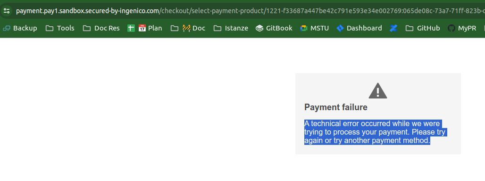

# Stand-Up Topics
	- vedi eventuali note in **Linked Reference**
	- ### Test ingenico cancellazione pagamento
		- Si riceve questo errore
		  
		- Forse la migliore soluzione é allungare la session del redis
- # Attivitá
  {{renderer :smartblock, resume-task, Resume Task ⏩️, false}} {{renderer :smartblock, new-task, New Task ➕, false}}
	- ### Riprendo Task Ingenico ⏩️
	  tags:: #event/task/resume
	  {{embed ((6597b47b-f850-4106-bb70-ec01764db5fe))}}
- # Aiuto compilazione
  Se hai bisogno di aiuto nelle compilazioni ecco alcuni riferimenti utili, questi blocchi sono inclusi con embed per evitare duplicazioni
	- {{embed ((6565c304-9cba-4238-91e6-36a5a4b45930))}}
	- {{embed ((6565c304-72f1-40e2-b2ac-a2eab69b4998))}}
	- {{embed ((6565c304-fbc2-4931-ab16-96384d8543be))}}