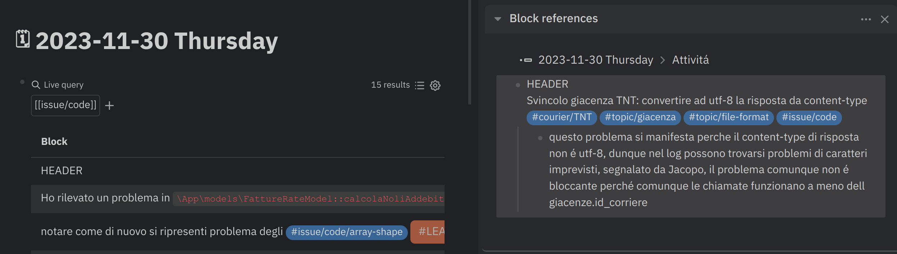
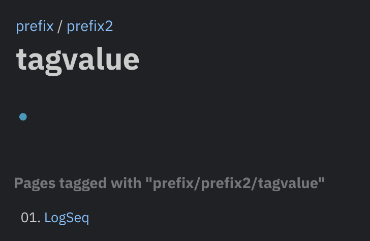
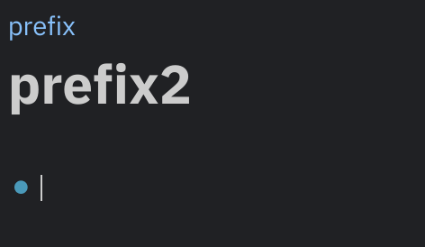

tags:: #[[Process/Information Capture]]

- # Scopo
	- Questa pagina sintetizza alcune informazioni utili riguardo a "a cosa serve" e "come usare" **LogSeq**
- # Introduzione
- Logseq sembra semplice all'apparenza, ma è estremamente potente sotto il cofano. Proprio come il famoso Microsoft Excel, Logseq vuole essere un ambiente per pensare. Il carburante di Excel sono blocchi di numeri, quello di Logseq sono **blocchi di parole**.
- Ci vuole tempo per padroneggiare questo strumento, poiché Logseq non impone un modo di lavorare. Ma una volta capito come ottenere i risultati finali desiderati, **Logseq vi aiuterà a diventare un pensatore molto più efficace**.
- Per aiutarvi a capire quali sono i flussi di lavoro che fanno al caso vostro, vi illustreremo tutte le funzioni principali di Logseq. Vedetele come strumenti nella vostra cassetta degli attrezzi; singolarmente uno strumento fa poco, ma una volta imparato a usarli in combinazione potete diventare un artista. **Puntate a diventare un artista della conoscenza.**
- # Definizioni
	- ## Grafo
		- **LogSeq** chiama la **rete interconnessa di note**  **"grafo"** ( **graph** in inglese )
		- É possibile avere piú grafi separati che poi corrispondono a delle cartelle sul proprio filesystem che vivono di vita propria, per esempio:
			- KB Gsped Privata
			- Progetto di studio sul Trading
			- Gestione del mio orto
			- ... e molto altro
		- Non sono inter-collegabili a livello di blocco o pagina, se non usando i link esterni
	- ## Blocco
		- Un blocco é l'unitá atomica in cui é possibile scrivere qualcosa
	- ## Pagina
		- La pagina non é altro che un blocco particolare del tipo piú specifico **pagina** a cui corrisponde anche in maniera **1:1** un artefatto di archiviazione sul disco , ovvero un file `.md`
- # Uso quotidiano
	- Mantenimento di un giornale delle attivitá o log
	- Mantenimento di un glossario
	- Gestione di un proprio workflow per il Getting Things Done
	- Accesso ad informazioni organizzate secondo diverse view
	- Mantenere appunti in maniera altamente organizzata e navigabile
- # Vantaggi
  id:: 654baa92-a7e7-46c5-816e-42bc25765463
	- **Links bidirezionali senza sforzo**: dal momento che si crea un link da **Concetto 1** verso **Concetto 2** si ottiene anche il link inverso
	- **Creazione di nuove pagine** in maniera **top-down** . Si evita quindi lo scenario classico adottato da molti tools che prevedono l'esistenza di una pagina prima di poter fare un link e quindi di dover concepire il percorso dell'informazione **bottom-up**.
	- Fa risparmiare tempo e aiuta a **concentrarsi esclusivamente sul contenuto** e la struttura dimenticandosi del livello di presentazione ( che potrá comunque essere gestito in un ipotetico processo di pubblicazione )
	- Dualismo **Tag 🔁 Pagina**: provate a pensare una pagina come ad un tag, il contenuto delle vostra pagina / tag a quel punto é la descrizione del tag.
	- **Embedded editing**:  potente funzione che permette di modificare una pagina collegata direttamete dal punto in cui viene riferita / puntata.
	- Mostra facilmente l'**utilizzo delle pagine** e **blocchi** da parte di altre pagine in termini quantitativi
	- Niente piú **link rotti**  nella tua documentazione: aggiornare il titolo di una pagina non rompe le references che la puntano nonostante i nodi siano prima di tutto files sul proprio filesystem #doc #topic/broken-link
	- Ricerca superveloce **full text** e **tag based**
	- Lascia molta libertá nell'organizzare le informazioni: albero, directory, grafo, blog, etc
	- Puó essere utilizzato per diversi scopi, dal creare documentazione pubblica o personale, al registro delle attivitá giornaliera, alla gestione di task legati o meno allo spazio di lavoro.
	- Invoglia a creare **note atomiche** quindi ad usare processi mentali in cui la sintesi é fondamentale per delimitare e collegare tra loro concetti in una rete di conosceza. #[[Process/Information Capture]] #[[topic/Network Thinking]] #Instrument/Zettelkasten
	- Dal momento che ci si sforza nel descrivere le informazioni nella maniera a noi piú congeniale si facilita anche la memorizzazione a lungo termine. #information-architecture #topic/mindmap
- # Funzioni utili
	- ## Links building
		- Esistono due modi per fare un link ad una pagina esistente :
			- `[[Questa pagina contiene degli spazi nel nome]]` : in questo caso se la vostra pagina contiene spazi nel nome usate questa sintassi
			  logseq.order-list-type:: number
			- `#TagWord` : se avete fretta e non volete inserire spazi usate la notazione tag based
			  logseq.order-list-type:: number
		- La bella notizia é che per creare un link ad una **pagina non ancora esistente** non devi fare niente di piú ! #SUCCESS
		- Altra differenza nelle due sintassi precedenti é la maniera in cui si visualizzano i link, ad esempio: [[topic]] e #topic
		-
	- ## Tags
	- ## Namespaces
		- Uso principale é per disambiguare dei nomi, ad esempio #issue non é #jira/issue
		- Organizzare insieme di argomenti correlati
		- Navigare insieme di argomenti correlati, indice
		- ### Come usarli in #gsped
	- ## Properties
	- ## Queries
		- ### Uso dell'header nelle queries
		  
- # Interni
	- Tutto é un albero o meglio un grafo
		- Puoi linkare non solo le pagine ma persino i blocchi
		- In realtá le pagina non sono altro che blocchi con un metadato che le fa risultare come pagine, quindi visibili nella sezione **All Pages** dal menú di sinistra, ma di fatto nel grafo sono semplicemente dei nodi.
		- Si ispira ad alcuni concetti dello #[[Instrument/Zettelkasten]] e del #[[topic/Network Thinking]]
		- Internamente usa degli id univoci per identificare .... i blocchi (  #Instrument/Zettelkasten )
	- Ogni nodo é un file markdown, eventualmente con il front-matter
	- Gli assets incollati come immagini vengono creati come link o files, in particolare il comportamento di creazione files puó essere forzato anche sui link
- # Pubblicazione
	- ## On-premise
	  id:: 655744a8-9998-4cf1-b139-a3cec80f75ad
		- Si puó pubblicare anche su proprio server https://devops.bike/publish-your-notes-as-site #topic/on-premise
	- ## Documenti
		- Export in vari formati
	- ## GitHub Pages
		- https://github.com/logseq/publish-spa
		-
- # Open Issues #question
	- capire come usare i tags e le properties sulle pagine e i blocchi
	- come reagiscono i namespace nei valori delle properties ?
		- come si comportano in particolare per la prop tags? alcuni tag di test
		  tags:: prefix/prefix2/tagvalue, prefix/prefix2
			- mi sembra di vedere che la sezione "pagine taggate con questo tag" si popola solo se il tag é presente esattamente nella property, quindi se il valore tag é organizzato con un namespace non viene menzionato sulla pagina del prefisso, questa pagina é taggata con #prefix/prefix2/tagvalue ma se si va su #prefix/prefix2 si vede questo
				- 
				- 
			- thread che parla di questo
				- https://discuss.logseq.com/t/the-most-legit-use-of-namespaces/17685/13
			- in generale potrebbe essere utile migliorare la visualizzazione con una query specifica anziché utilizzare questa vista di default
				- verificare anche se si possa disattivare
- # Templates utili
	- Possono contenere sostanzialmente dei blocchi
	- Esiste un modo di interpolare variabili
	- Ho creato un namespace dedicato per organizzare tutti i [[Templates]] utilizzati in questo grafo