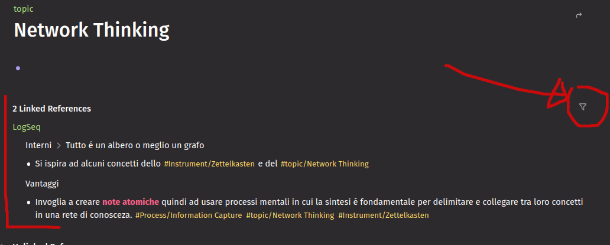

tags:: #[[Process/Information Capture]]

- # Scopo
	- Questa pagina sintetizza alcune informazioni utili riguardo a "a cosa serve" e "come usare" **LogSeq**
- # Introduzione
  Una veloce introduzione dopo 20 giorni di utilizzo
- Logseq sembra semplice all'apparenza, ma è estremamente potente sotto il cofano. Proprio come il famoso Microsoft Excel, Logseq vuole essere un ambiente per pensare. Il carburante di Excel sono blocchi di numeri, quello di Logseq sono **blocchi di parole**.
- Ci vuole tempo per padroneggiare questo strumento, poiché Logseq non impone un modo di lavorare. Ma una volta capito come ottenere i risultati finali desiderati, **Logseq vi aiuterà a diventare un pensatore molto più efficace**.
- Per aiutarvi a capire quali sono i flussi di lavoro che fanno al caso vostro, vi illustreremo tutte le funzioni principali di Logseq. Vedetele come strumenti nella vostra cassetta degli attrezzi; singolarmente uno strumento fa poco, ma una volta imparato a usarli in combinazione potete diventare un artista. **Puntate a diventare un artista della conoscenza.**
- # Definizioni
	- ## Grafo
		- **LogSeq** chiama la **rete interconnessa di note**  **"grafo"** ( **graph** in inglese )
		- É possibile avere piú grafi separati che poi corrispondono a delle cartelle sul proprio filesystem che vivono di vita propria, per esempio:
			- KB Gsped Privata
			- Progetto di studio personale
			- Pianificazione semine mio orto
			- ... e molto altro
		- Non sono inter-collegabili a livello di blocco o pagina, se non usando i link esterni
	- ## Blocco
		- Un blocco é l'unitá atomica in cui é possibile scrivere qualcosa
	- ## Pagina
		- La pagina non é altro che un blocco particolare del tipo piú specifico **pagina** a cui corrisponde anche in maniera **1:1** un artefatto di archiviazione sul disco , ovvero un file `.md`
- # Uso quotidiano
	- Mantenimento di un giornale delle attivitá o log
	- Mantenimento di un glossario
	- Gestione di un proprio workflow per il Getting Things Done
	- Vari scenari dove voglio catalogare una certa classe di informazioni per poi ripescarla
		- Tenere un archivio personale di soluzione comuni ai problemi #troubleshooting
		- Tenere un archivio personale di azioni da intraprendere #action
		- Censire problematiche ricorrenti #issue
	- Accesso ad informazioni organizzate secondo diverse view
	- Mantenere appunti in maniera altamente organizzata e navigabile
	- Fare  una presentazione come questa che state vedendo in 5 minuti !
- # Vantaggi
  id:: 654baa92-a7e7-46c5-816e-42bc25765463
	- **Links bidirezionali senza sforzo**: dal momento che si crea un link da **Concetto 1** verso **Concetto 2** si ottiene anche il link inverso
	- **Creazione di nuove pagine** in maniera **top-down** . Si evita quindi lo scenario classico adottato da molti tools che prevedono l'esistenza di una pagina prima di poter fare un link e quindi di dover concepire il percorso dell'informazione **bottom-up**.
	- Fa risparmiare tempo e aiuta a **concentrarsi esclusivamente sul contenuto** e la struttura dimenticandosi del livello di presentazione ( che potrá comunque essere gestito in un ipotetico processo di pubblicazione )
	- Dualismo **Tag 🔁 Pagina**: provate a pensare ad una pagina come ad un tag. Il contenuto delle vostra pagina ( o tag appunto quando conferite ad una pagina questo significato  ) potrá essere la descrizione del tag, quindi il nome di tale pagina sará il metadato utilizzato per taggare un contenuto, nel caso di #logseq un blocco o una pagina.
	  id:: 656f5a7f-61a8-4d27-9861-fcd202981f28
		- #+BEGIN_TIP
		  **Non esiste alcun meccanismo particolare per eleggere una pagina a tag**: semplicemente dipende dal significato che voi attribuirete a quel tag: nel caso abbiate bisogno di un particolare tag per raccogliere tutti i blocchi che citano un certo argomento non farete altro che taggare tali blocchi con un tag ( quindi in realtá una pagina ) che riutilizzerete per convezione. Questo é il concetto di flessibilitá di cui parlavamo all'inizio
		  #+END_TIP
	- **Embedded editing**:  potente funzione che permette di modificare una pagina collegata direttamete dal punto in cui viene riferita / puntata.
	- Mostra facilmente l'**utilizzo delle pagine** e **blocchi** da parte di altre pagine in termini quantitativi
	- Niente piú **link rotti**  nella tua documentazione: aggiornare il titolo di una pagina non rompe le references che la puntano nonostante i nodi siano prima di tutto files sul proprio filesystem #doc #topic/broken-link
	- Ricerca superveloce **full text** e **tag based**
	- Lascia molta libertá nell'organizzare le informazioni: albero, directory, grafo, blog, etc
	- Puó essere utilizzato per diversi scopi, dal creare documentazione pubblica o personale, al registro delle attivitá giornaliera, alla gestione di task legati o meno allo spazio di lavoro.
	- Invoglia a creare **note atomiche** quindi ad usare processi mentali in cui la sintesi é fondamentale per delimitare e collegare tra loro concetti in una rete di conosceza. #[[Process/Information Capture]] #[[topic/Network Thinking]] #Instrument/Zettelkasten
	- Dal momento che ci si sforza nel descrivere le informazioni nella maniera a noi piú congeniale si facilita anche la memorizzazione a lungo termine. #information-architecture #topic/mindmap
- # Funzioni utili
	- ## Links building
		- **Ricordati del**  ((656f5a7f-61a8-4d27-9861-fcd202981f28))
		- Esistono due modi per fare un link ad una pagina esistente :
			- `[[Questa pagina contiene degli spazi nel nome]]` : in questo caso se la vostra pagina contiene spazi nel nome usate questa sintassi
			  logseq.order-list-type:: number
			- `#TagWord` : se avete fretta e non volete inserire spazi usate la notazione tag based
			  logseq.order-list-type:: number
		- La bella notizia é che per creare un link ad una **pagina non ancora esistente** non devi fare niente di piú ! #SUCCESS
		- Altra differenza nelle due sintassi precedenti é la maniera in cui si visualizzano i link
		  ad esempio: [[topic]] non mostra il cancelletto e #topic lo mostra
		- Nel caso volessi visualizzare il cancelletto su un link ad una pagina con spazi nel nome usa questa sintassi  `#[[Process/SDC/Continuous Integration]]`
	- ## Inline block editing
		- Forse una delle funzioni piú scenografiche di #LogSeq, che vi fará pensare: "quanto lavoro mi avrebbe evitato?"
		- Similmente alla funzione **include / page embed**  di #jira , #logseq permette di fare un embed di un **blocco** o di una **pagina**, e fino a qui le cose non stanno diversamente, in questo modo evitate di creare un duplicato di testo nella vostra #topic/knowledge-base ...
		- #+BEGIN_IMPORTANT
		  Tuttavia l'embedding di un blocco o pagina in #logseq oltre alla visualizzazione del blocco permette anche l'editing, questo implica **non spostarsi** tra le pagine **intercollegate** al solo scopo di modificarne le informazioni!
		  #+END_IMPORTANT
		-
	- ## Tags
		- Cosa é un tag in #logseq ?
			- un modo per classificare un blocco o pagina identificando delle parole
		- Ogni pagina puó essere vista come un tag
		- Lo scopo di definire dei tag é quello di poter facilmente recuperare tutte le pagine che riferiscono un tag
		- In questa immagine vediamo che nella pagina usata come tag #[[topic/Network Thinking]] #LogSeq crea un indice di tutte le altre pagine che la riferiscono, quindi dal momento che coniate un nuovo tag in automatico otterrete una pagina raccoglitore che elenca tutte le pagine che la riferiscono
		  
		- #+BEGIN_TIP
		  L'elenco dei referenti é anche filtrabile !
		  #+END_TIP
	- ## Namespaces
		- Uso principale é per disambiguare dei nomi, ad esempio #issue non é #jira/issue
		- Organizzare insieme di argomenti correlati
		- Navigare insieme di argomenti correlati, indice
		- ### Esempi pratici di utilizzo
			- un namespace #topic equivalente ad un glossario dove ogni sotto termine rappresenta un concetto o un termine degno di nota in #gsped, es: #[[topic/esubero multiplo]]
			- un namespace #issue per censire le classi di issue che si presentano, es: #issue/design, #issue/process, #issue/code, ...
	- ## Properties
		- a che servono le properties ? evoluzione del tags
	- ## Queries
		- ### Uso dell'header nelle queries
		  
- # Interni
	- Tutto é un albero o meglio un grafo
		- Puoi linkare non solo le pagine ma persino i blocchi
		- In realtá le pagina non sono altro che blocchi con un metadato che le fa risultare come pagine, quindi visibili nella sezione **All Pages** dal menú di sinistra, ma di fatto nel grafo sono semplicemente dei nodi.
		- Si ispira ad alcuni concetti dello #[[Instrument/Zettelkasten]] e del #[[topic/Network Thinking]]
		- Internamente usa degli id univoci per identificare .... i blocchi (  #Instrument/Zettelkasten )
	- Ogni nodo é un file markdown, eventualmente con il front-matter
	- Gli assets incollati come immagini vengono creati come link o files, in particolare il comportamento di creazione files puó essere forzato anche sui link
- # Pubblicazione
	- ## On-premise
	  id:: 655744a8-9998-4cf1-b139-a3cec80f75ad
		- Si puó pubblicare anche su proprio server https://devops.bike/publish-your-notes-as-site #topic/on-premise
	- ## Documenti
		- Export in vari formati
	- ## GitHub Pages
		- https://github.com/logseq/publish-spa
		-
- # Open Issues
  tags:: #improvements/logseq, #issue/information
	- capire come usare i tags e le properties sulle pagine e i blocchi
	- come reagiscono i namespace nei valori delle properties ?
		- come si comportano in particolare per la prop tags? alcuni tag di test
		  tags:: prefix/prefix2/tagvalue, prefix/prefix2
			- mi sembra di vedere che la sezione "pagine taggate con questo tag" si popola solo se il tag é presente esattamente nella property, quindi se il valore tag é organizzato con un namespace non viene menzionato sulla pagina del prefisso, questa pagina é taggata con #prefix/prefix2/tagvalue ma se si va su #prefix/prefix2 si vede questo
				- 
				- 
			- thread che parla di questo
				- https://discuss.logseq.com/t/the-most-legit-use-of-namespaces/17685/13
			- in generale potrebbe essere utile migliorare la visualizzazione con una query specifica anziché utilizzare questa vista di default
				- verificare anche se si possa disattivare
- # Templates utili
	- Possono contenere sostanzialmente dei blocchi
	- Esiste un modo di interpolare variabili
	- Ho creato un namespace dedicato per organizzare tutti i [[Templates]] utilizzati in questo grafo