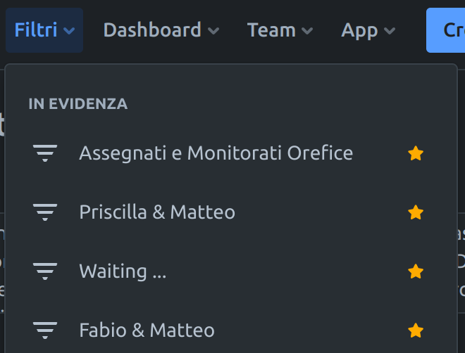

tags:: #[[Process/Process Improvement]] , #Process/SDC/analysis

- NOW Analizzare e provare a creare una presentazione
  :LOGBOOK:
  CLOCK: [2023-11-30 Thu 10:27:48]
  :END:
- ascolatare audio `2023-11-30 09-49-53.mkv` e trascrivere
- la cosa importante da capire e che spero verrá trasmessa a tutti in gsped é che :
- gli sprint sono mensili, quindi se a qualcuno viene in mente qualcosa e vuole sia fatto in tempo umano deve sapere che se la grande idea avviene il 30 del mese, deve censirla in analisi a tutti i costi e non un giorno di piu rispetto alla riunione in cui si prelevano i task dal backlog che é il 1mo del mese successivo
- si deve avere bene in mente che se un'attivitá che necessitá di un po' di giornate di sviluppo e va analizzata da tutto il gruppo direi che sia realistico pensare che dal momento dell'inserimento nelal lista di analisi fino a vederla da qualche parte implementata difficilmente passino meno di 45 giorni, 45 giorni sarei proprio ottimista
- bisogna capire quali attivitá possono sfuggire a questo meccanismo ed essere fatte subito, quindi diventa fondamentale capire il criterio di urgenza per tutti e va condiviso
- eh ma a me non piace molto e non lo uso molto
- perdonate ma
- i non sviluppatori devono diventare parte attiva  del flusso delle code, magari con board a loro riservate
- dove poter censire le richieste degli stackholder? fare un backlog dedicato dove la gente possa metterci qualcosa dentro separata dalle cose da fare altrimenti diventa un pandemonio a mio parere
	- le attivitá che potrebbero finire da una parte ( fare subito ) o dall'altra ( analizzare )
- in che stato metto le card che possono essere riprese, unlocked, dopo che la feature da cui dipendono é stata implementata? #jira/issue/meta
- creare un filtro anche per vedere a coppie o gruppi i task in comune, ragionare per reparti
	- https://gsped.atlassian.net/issues/?filter=10664
	- Filtro utile per task condivisi con uno stakeholder in particolare
	  ```
	  # Jira JQL per filtro di coppia
	  status != Pending and status != Waiting and  issuetype not in (subTaskIssueTypes()) AND 
	  (watcher = currentUser() OR assignee = currentUser() or reporter = currentUser())  AND 
	  status != Done AND status != Completed AND status != Resolved AND ("Category[Category]" is EMPTY OR 
	  "Category[Category]" != "Ricerca e Sviluppo" AND "Category[Category]" != "Best Practices") AND 
	  (watcher = 'Fabio Alessio' OR assignee = 'Fabio Alessio' OR reporter = 'Fabio Alessio')  
	  ORDER BY priority DESC, created DESC, status DESC
	  ```
	- 
- non sarebbe male avere uno stato adatto per mettere la card quando é in attesa di PR per non mettere completata comunque
	- a quel punto dovrá essere ripescata quando quella da cui dipende é marcata come done #jira/automation
- fondamentale sapere su cosa si sta lavorando #warning prima della pickup analisi dal backlog
- fondamentale capire la soglia minima di effort per censire i task in analisi #WARNING
- # Perché tutto funzioni
- # Casi di fallimento del processo
  tags:: #issue/failure, #issue/process
	- {{query (and [[issue/failure]] [[issue/process]])[[issue/failure]]}}
	  query-table:: true
	  query-properties:: [:block :page]