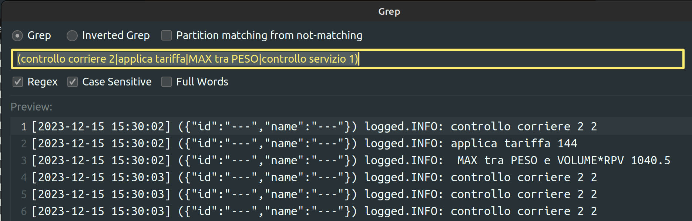
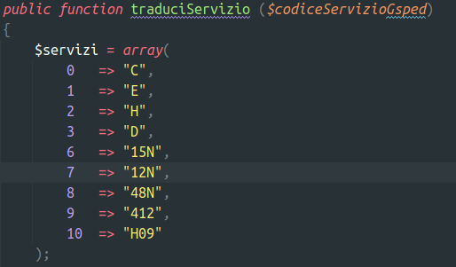
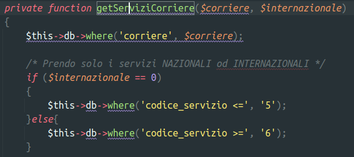
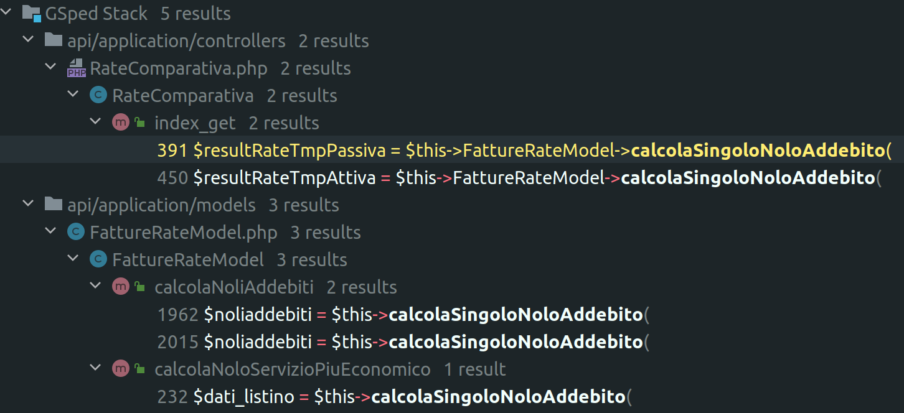

tags:: #[[Models/Object Model/Object]]

- Deputato al #business-rule/calcolo-tariffario a partire dai dati di una fattura
-
- # Metodi
	- ## `private function calcolaTariffa(...)`
	  tags:: #business-rule/calcolo-tariffario
		- Calcola il valore finale
		- Ritorna `false` in caso non ci siano le condizioni per calcolare la tariffa
		- ### Sequenza
			- fa alcuni controlli che potrebbero interrompere il calcolo della tariffa
				- ie: se il tipo listino non é conforme al listino per la quale la tariffa é specificata
			- controllo sulle zone incluse se `zone_incluse` diverso da `MONDO`
		- nella prima parte c'é un un if 👿 che lascia sfuggire alcune condizioni #issue/code #issue/bug
		- gli esuberi potrebbero essere calcolati meglio e in maniera piú flessibile ((6555222a-3562-4770-b8ba-f64a070f7cc7))
		- proseguire a documentare #action/doc
- # Soluzione ai problemi comuni
  tags:: #troubleshooting
  {{renderer :smartblock, trouble-solution, New Solution ➕, false}}
	- ## Filtrare log selezione di una fascia tariffaria in log `api-yyyy-mm-dd.txt` 
	  id:: fb99f650-ffad-4b58-bd10-4dec0dc86850
	  tags:: [[troubleshooting/solution]], #model/fatturazione/tariffe_fasce, #topic/fascia, #business-rule/calcolo-tariffario, #Instrument/IDE/PHPStorm, #model/fatturazione/tariffe, #Instrument/grep, #topic/servizio, #model/fatturazione/RateComparativa, #model/fatturazione/FattureRate
		- Installare il plugin ((657c6627-98d6-4e6b-8ec0-22e7d97a015f))
		- Aprire il file di log `.txt`
		- `CTRL+SHIFT+A` e digitare grep
		- Inserire questa regexp `(\[nome\] =>|\[id\] =>|Numero tariffe recuperate|Nessuna fascia|Query scelta tariffe|controllo corriere 2|applica tariffa|MAX tra PESO|VOLUME|RPV|controllo servizio.*(E|1))`
		- Marcare spunta regexp e case sensitive
		- 
		- Ricordare questa mappatura per i servizi: i servizi vengono ricavati con questo filtro e poi tradocci in codici letterali
		  tags:: #business-rule, #business-rule/selezione
		  
		  
	- ## Esaminare log chiamata FattureRate su #env/staging 
	  id:: 6553499b-9e4a-464c-b2f8-10d46d011e37
	  tags:: #[[model/fatturazione/FattureRateModel]], #troubleshooting/solution
	  collapsed:: true
		- Per poter esaminare il log dobbiamo usare la macchina di staging
		- effettuare una chiamata come la seguente
		- ```
		  GET http://apistaging.aws.gsped.it/stampasi/FattureRate/?
		      client_id=7&
		      colli=3&
		      corriere=101&
		      date_created=2023-10-02&
		      peso=35.60&
		      rcpt_cap=20900&
		      rcpt_city=monza&
		      rcpt_country_code=IT&
		      sender_cap=20124&
		      sender_city=Milano&
		      sender_country_code=IT&
		      servizio=0&
		      volume=18&
		      documenti=0&
		      valore=0.000&
		      tipo_listino=passivo&
		      fuel=0&
		      fuel_int=0&
		      fuel_air=0
		  ```
		  id:: 65771539-8ce5-4d8c-bac9-bafbe2757805
		- Quindi esaminare il log
		- ```bash
		  docker exec  api cat '/tmp/api-2023-10-11.txt' | less
		  ```
		- Conviene creare documentazione di alto livello per i componenti di GSped, ad esempio il modello #[[Instrument/C4]] puó essere usato per descrivere ad alto livello un sistema
		- Inoltre andrebbero #[[model/fatturazione/FattureRateModel]]
- # Problemi noti
	- Il metodo checkReseller non dovrebbe decidere se utilizzare un client id ( invoiced o normale ) indicato sulla `$sped`, questo dovrebbe essere passato da fuori e fine #issue/design
		- la responsabilitá di scegliere quale client id utilizzare dovrebbe spettare al chiamate
		- le tariffe non hanno relazione alcuna con il concetto di #model/core/reseller
	- `calcolaSingoloNoloAddebito` non é chiaro se riceva sempre `$sped['corriere']` #issue/code/array-shape
	  
-